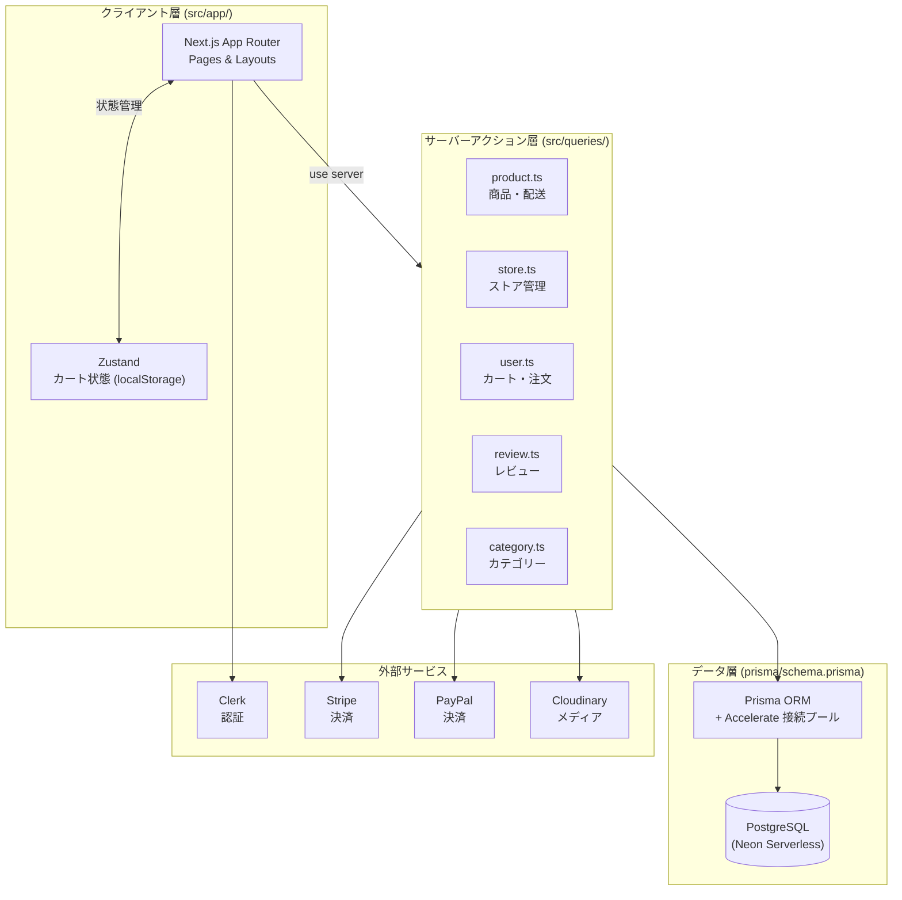
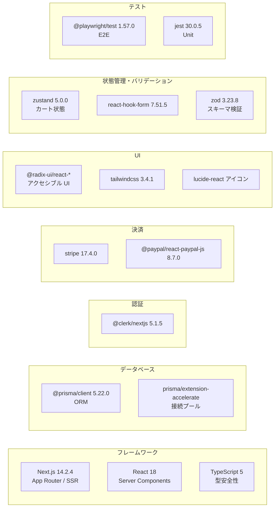
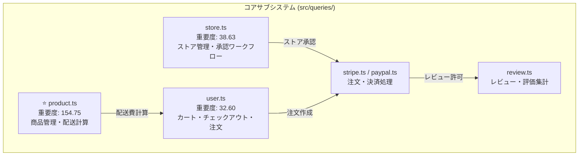
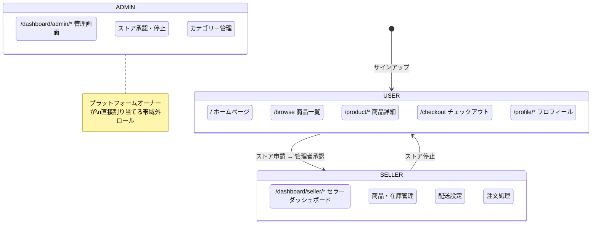
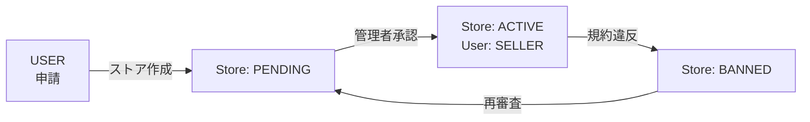
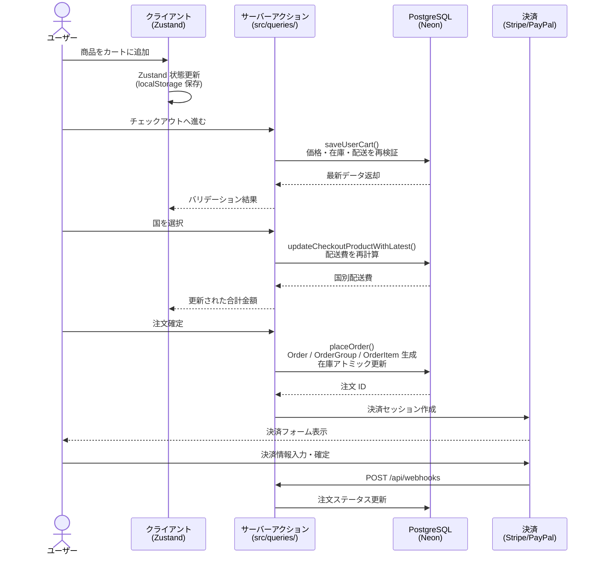
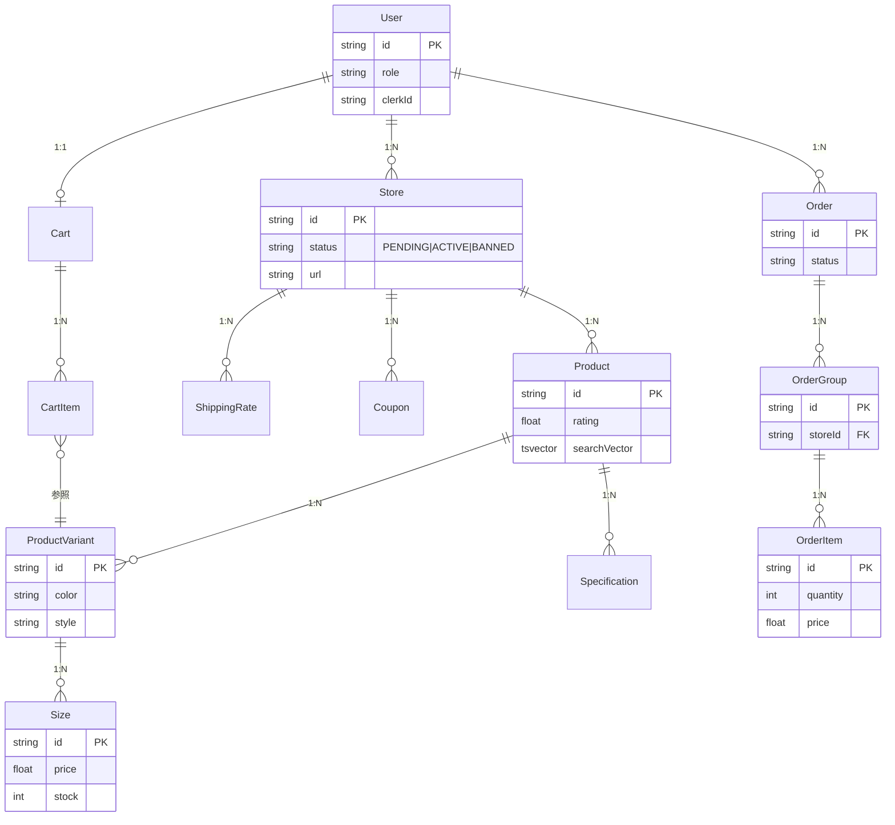
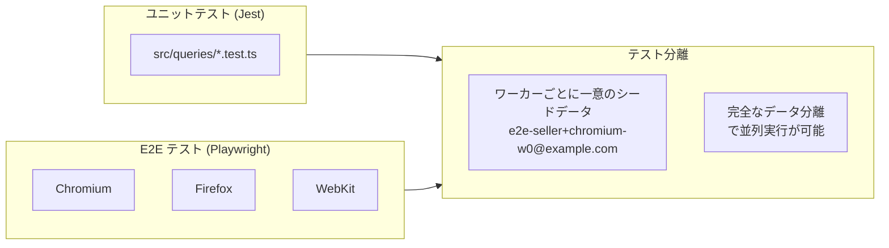
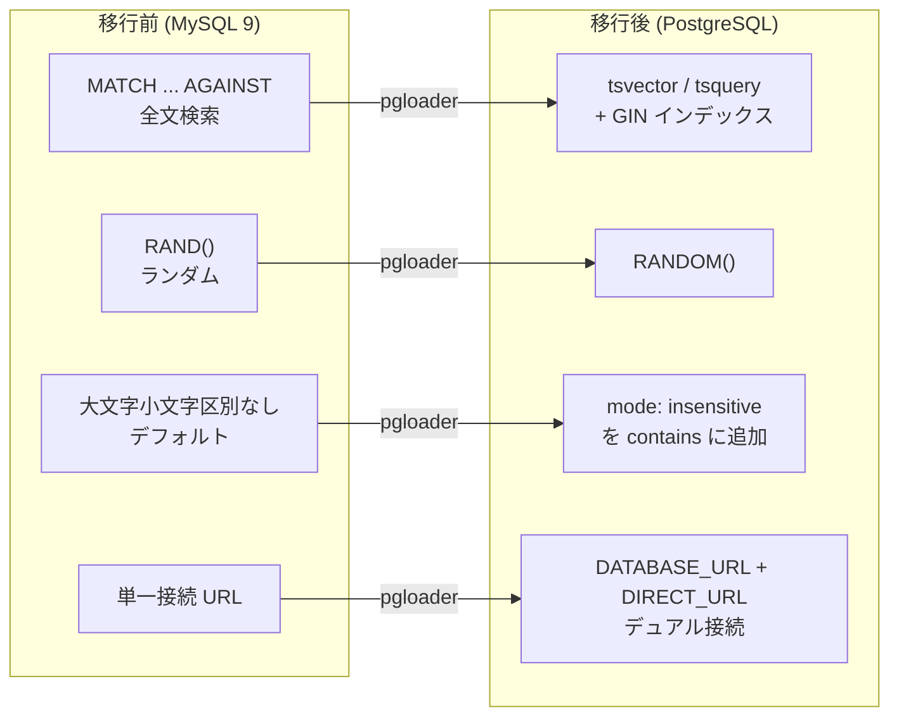

# マルチベンダー EC プラットフォーム — 概要

> **関連ドキュメント**: [システムアーキテクチャ](./specs/multi-vendor-ecommerce/02-architecture.md) | [コアビジネスシステム](./specs/multi-vendor-ecommerce/05-workflows.md) | [ユーザーインターフェース](./specs/multi-vendor-ecommerce/04-interfaces.md) | [開発・インフラ](./specs/multi-vendor-ecommerce/06-quality.md)

本ドキュメントは、マルチベンダー EC プラットフォームのアーキテクチャ・技術スタック・コアビジネスシステムについての概要を提供します。このプラットフォームは、複数の独立したセラーが統一されたマーケットプレイス内でストアを運営し、顧客が 1 回のトランザクションで異なるベンダーから購入できる仕組みを実現しています。

---

## 📋 目次

- [プラットフォームの目的と機能](#プラットフォームの目的と機能)
- [システムアーキテクチャ：3 層設計](#システムアーキテクチャ3-層設計)
- [技術スタック](#技術スタック)
- [コアビジネスサブシステム](#コアビジネスサブシステム)
- [ユーザーロールとアクセス制御](#ユーザーロールとアクセス制御)
- [データフロー：商品閲覧から注文確定まで](#データフロー商品閲覧から注文確定まで)
- [プロジェクトディレクトリ構成](#プロジェクトディレクトリ構成)
- [データベースアーキテクチャ：PostgreSQL × Prisma](#データベースアーキテクチャpostgresql--prisma)
- [開発環境とワークフロー](#開発環境とワークフロー)
- [マイグレーション履歴：MySQL → PostgreSQL](#マイグレーション履歴mysql--postgresql)
- [AI エージェント連携と仕様駆動開発 (SDD)](#ai-エージェント連携と仕様駆動開発-sdd)
- [関連ドキュメント](#関連ドキュメント)

---

## プラットフォームの目的と機能

**Next.js 14 App Router** で構築されたマルチベンダー EC マーケットプレイスで、3 つのユーザーロールをサポートします。

| ロール | 機能 |
|--------|------|
| **USER** | 商品閲覧・カート管理・注文・レビュー投稿・ストアフォロー |
| **SELLER** | ストア作成・管理、商品バリアント出品、配送料設定、注文処理 |
| **ADMIN** | ストア承認、カテゴリー管理、プラットフォームコンテンツのモデレーション |

### 主要機能

- **複雑な商品階層**: 商品 → バリアント（カラー/スタイル）→ サイズ（個別価格）
- **マルチベンダー注文処理**: 1 回のチェックアウトをストアごとの注文グループに分割
- **柔軟な配送システム**: 3 種の計算方式（個数・重量・定額）＋国別上書き設定
- **デュアル決済ゲートウェイ**: Stripe / PayPal による国際対応
- **リアルタイム在庫管理**: 注文時のバリデーションパイプラインと在庫更新
- **全文商品検索**: PostgreSQL `tsvector`/`tsquery` + GIN インデックス

---

## システムアーキテクチャ：3 層設計


```mermaid
graph TB
    subgraph CLIENT["クライアント層 (src/app/)"]
        PAGES["Next.js App Router<br>Pages & Layouts"]
        ZUSTAND["Zustand<br>カート状態 (localStorage)"]
    end

    subgraph SERVER["サーバーアクション層 (src/queries/)"]
        PRODUCT["product.ts<br>商品・配送"]
        STORE["store.ts<br>ストア管理"]
        USER["user.ts<br>カート・注文"]
        REVIEW["review.ts<br>レビュー"]
        CATEGORY["category.ts<br>カテゴリー"]
    end

    subgraph DATA["データ層 (prisma/schema.prisma)"]
        PG[("PostgreSQL<br>(Neon Serverless)")]
        PRISMA["Prisma ORM<br>+ Accelerate 接続プール"]
    end

    subgraph EXTERNAL["外部サービス"]
        CLERK["Clerk<br>認証"]
        STRIPE["Stripe<br>決済"]
        PAYPAL["PayPal<br>決済"]
        CLOUDINARY["Cloudinary<br>メディア"]
    end

    PAGES -->|"use server"| SERVER
    PAGES <-->|状態管理| ZUSTAND
    SERVER --> PRISMA
    PRISMA --> PG
    PAGES --> CLERK
    SERVER --> STRIPE
    SERVER --> PAYPAL
    SERVER --> CLOUDINARY
```

### アーキテクチャ層の説明

| 層 | パス | 役割 |
|----|------|------|
| **クライアント層** | `src/app/` | Next.js App Router のページ・レイアウト、サーバー/クライアントコンポーネント |
| **サーバーアクション層** | `src/queries/` | `"use server"` ディレクティブによるビジネスロジック・DB直接アクセス |
| **データ層** | `prisma/schema.prisma` | Prisma ORM 経由の PostgreSQL アクセス（接続プール付き） |
| **外部サービス** | — | Clerk（認証）・Stripe/PayPal（決済）・Cloudinary（メディア）・Neon（DB ホスティング） |
| **クライアント状態** | `cart-store/` | Zustand によるカート操作（localStorage に永続化） |

---

## 技術スタック


```mermaid
graph LR
    subgraph FW["フレームワーク"]
        NEXT["Next.js 14.2.4<br>App Router / SSR"]
        REACT["React 18<br>Server Components"]
        TS["TypeScript 5<br>型安全性"]
    end

    subgraph DB["データベース"]
        PRISMA_C["@prisma/client 5.22.0<br>ORM"]
        ACCEL["prisma/extension-accelerate<br>接続プール"]
    end

    subgraph AUTH["認証"]
        CLERK_P["@clerk/nextjs 5.1.5"]
    end

    subgraph PAY["決済"]
        STRIPE_P["stripe 17.4.0"]
        PP["@paypal/react-paypal-js 8.7.0"]
    end

    subgraph UI["UI"]
        RADIX["@radix-ui/react-*<br>アクセシブル UI"]
        TW["tailwindcss 3.4.1"]
        LUCIDE["lucide-react アイコン"]
    end

    subgraph STATE["状態管理・バリデーション"]
        ZUS["zustand 5.0.0<br>カート状態"]
        RHF["react-hook-form 7.51.5"]
        ZOD["zod 3.23.8<br>スキーマ検証"]
    end

    subgraph TEST["テスト"]
        PW["@playwright/test 1.57.0<br>E2E"]
        JEST["jest 30.0.5<br>Unit"]
    end
```

### 依存関係一覧

| カテゴリ | パッケージ | バージョン | 用途 |
|----------|-----------|-----------|------|
| **フレームワーク** | `next` | 14.2.4 | App Router・SSR・ルーティング |
| | `react` | 18 | UI ライブラリ・Server Components |
| | `typescript` | 5 | 型安全性 |
| **データベース** | `@prisma/client` | 5.22.0 | PostgreSQL 用 ORM |
| | `@prisma/extension-accelerate` | 1.2.0 | 接続プール |
| **認証** | `@clerk/nextjs` | 5.1.5 | ユーザー認証・管理 |
| **決済** | `stripe` | 17.4.0 | Stripe 決済処理 |
| | `@paypal/react-paypal-js` | 8.7.0 | PayPal 連携 |
| **メディア** | `next-cloudinary` | 6.6.2 | Cloudinary 画像アップロード |
| **UI コンポーネント** | `@radix-ui/react-*` | 各種 | アクセシブル UI プリミティブ（30+ パッケージ） |
| | `tailwindcss` | 3.4.1 | CSS ユーティリティ |
| | `lucide-react` | 0.394.0 | アイコンライブラリ |
| **状態管理** | `zustand` | 5.0.0 | グローバルカート状態 |
| | `react-hook-form` | 7.51.5 | フォーム処理 |
| | `zod` | 3.23.8 | スキーマバリデーション |
| **テスト** | `@playwright/test` | 1.57.0 | E2E テスト |
| | `jest` | 30.0.5 | ユニットテスト |
| **ランタイム** | Bun | — | パッケージマネージャー・ランタイム（npm の代替） |

---

## コアビジネスサブシステム

`src/queries/` 配下にサーバーアクションとして実装された 5 つの主要ドメインサブシステムです。


```mermaid
graph TD
    subgraph SUBSYSTEMS["コアサブシステム (src/queries/)"]
        P["⭐ product.ts<br>重要度: 154.75<br>商品管理・配送計算"]
        S["store.ts<br>重要度: 38.63<br>ストア管理・承認ワークフロー"]
        U["user.ts<br>重要度: 32.60<br>カート・チェックアウト・注文"]
        R["review.ts<br>レビュー・評価集計"]
        O["stripe.ts / paypal.ts<br>注文・決済処理"]
    end

    P -->|配送費計算| U
    S -->|ストア承認| O
    U -->|注文作成| O
    O -->|レビュー許可| R
```

### 1. 商品管理システム（`product.ts`）

> **重要度: 154.75**（最重要サブシステム）

- **商品階層**: `Product` → `ProductVariant`（カラー/スタイル）→ `Size`（価格・在庫）
- **主要関数**: `getProducts()` / `getProductPageData()` / `upsertProduct()` / `deleteProduct()`
- **配送計算**: `getShippingDetails()` — 3 方式（ITEM / WEIGHT / FIXED）
- **検索統合**: PostgreSQL `tsvector` インデックスによる全文検索

### 2. ストア管理システム（`store.ts`）

> **重要度: 38.63**（マルチベンダーのコア）

- **ストアライフサイクル**: PENDING → ACTIVE → BANNED（管理者承認が必要）
- **配送設定**: デフォルトレート ＋ 国別 `ShippingRate` 上書き
- **主要関数**: `upsertStore()` / `updateStoreStatus()` / `getStoreData()`
- **ロール昇格**: ストア承認時に USER → SELLER へ昇格

### 3. ユーザー & カートシステム（`user.ts`）

> **重要度: 32.60**（チェックアウトのオーケストレーション）

- **カートバリデーションパイプライン**: `saveUserCart()` がサーバー側で価格・在庫・配送を再検証
- **注文処理**: `placeOrder()` が `Order` → `OrderGroup`（ストアごと）→ `OrderItem` を生成
- **住所管理**: ユーザーごとに複数の配送先住所
- **主要関数**: `updateUserInfo()` / `updateCheckoutProductWithLatest()` / `getUserCart()`

### 4. レビュー & 評価システム（`review.ts`）

- **レビュー投稿**: Cloudinary 画像アップロード付き `upsertReview()`
- **評価集計**: レビューごとに `Product.rating` と `numReviews` を更新
- **フィルタリング**: `getProductFilteredReviews()` — 星評価・画像有無・並び順
- **詳細コンテキスト**: バリアント・サイズ・購入数量を記録

### 5. 注文 & 決済処理（`stripe.ts` / `paypal.ts`）

- **決済ゲートウェイ**: Stripe と PayPal のデュアル統合
- **注文分解**: 顧客の 1 件の注文をストアレベルの `OrderGroup` に分割
- **在庫更新**: 決済成功時に在庫をアトミックにデクリメント
- **Webhook 処理**: `POST /api/webhooks` で決済確認を処理

---

## ユーザーロールとアクセス制御


```mermaid
stateDiagram-v2
    [*] --> USER: サインアップ
    USER --> SELLER: ストア申請 → 管理者承認
    SELLER --> USER: ストア停止

    state USER {
        u1: / ホームページ
        u2: /browse 商品一覧
        u3: /product/* 商品詳細
        u4: /checkout チェックアウト
        u5: /profile/* プロフィール
    }

    state SELLER {
        s1: /dashboard/seller/* セラーダッシュボード
        s2: 商品・在庫管理
        s3: 配送設定
        s4: 注文処理
    }

    state ADMIN {
        a1: /dashboard/admin/* 管理画面
        a2: ストア承認・停止
        a3: カテゴリー管理
    }

    note right of ADMIN : プラットフォームオーナーが\n直接割り当てる帯域外ロール
```

| ロール | アクセスレベル | 主要ルート | サーバーアクション |
|--------|--------------|-----------|------------------|
| **USER** | デフォルト | `/`, `/browse`, `/product/*`, `/checkout`, `/profile/*` | 注文・レビュー・カート管理 |
| **SELLER** | ストア承認後 | `/dashboard/seller/*` | 商品作成・在庫管理・配送設定・注文処理 |
| **ADMIN** | プラットフォームオーナー | `/dashboard/admin/*` | ストア承認・カテゴリー管理・コンテンツモデレーション |

### アクセス制御の実装

- **ミドルウェア**: `src/middleware.ts` が `/dashboard/*`・`/checkout`・`/profile/*` を保護
- **サーバーアクション**: Clerk の `currentUser()` で ID とロールを検証
- **ロール昇格**: `src/queries/store.ts` の `updateStoreStatus()` が USER → SELLER に昇格

### ストアのライフサイクル


```mermaid
flowchart LR
    A["USER<br>申請"] -->|ストア作成| B["Store: PENDING"]
    B -->|管理者承認| C["Store: ACTIVE<br>User: SELLER"]
    C -->|規約違反| D["Store: BANNED"]
    D -->|再審査| B
```

---

## データフロー：商品閲覧から注文確定まで


```mermaid
sequenceDiagram
    actor User as ユーザー
    participant Client as クライアント<br>(Zustand)
    participant SA as サーバーアクション<br>(src/queries/)
    participant DB as PostgreSQL<br>(Neon)
    participant Payment as 決済<br>(Stripe/PayPal)

    User->>Client: 商品をカートに追加
    Client->>Client: Zustand 状態更新<br>(localStorage 保存)

    User->>SA: チェックアウトへ進む
    SA->>DB: saveUserCart()<br>価格・在庫・配送を再検証
    DB-->>SA: 最新データ返却
    SA-->>Client: バリデーション結果

    User->>SA: 国を選択
    SA->>DB: updateCheckoutProductWithLatest()<br>配送費を再計算
    DB-->>SA: 国別配送費
    SA-->>Client: 更新された合計金額

    User->>SA: 注文確定
    SA->>DB: placeOrder()<br>Order / OrderGroup / OrderItem 生成<br>在庫アトミック更新
    DB-->>SA: 注文 ID

    SA->>Payment: 決済セッション作成
    Payment-->>User: 決済フォーム表示
    User->>Payment: 決済情報入力・確定
    Payment->>SA: POST /api/webhooks
    SA->>DB: 注文ステータス更新
```

### 主要バリデーションポイント

| ステップ | 処理 | 目的 |
|----------|------|------|
| ① クライアント側カート（Zustand） | 高速な UI 更新 | localStorage に永続化 |
| ② サーバー側バリデーション（`saveUserCart`） | DB から価格・在庫・配送を再計算 | 不正操作の防止 |
| ③ チェックアウト更新（`updateCheckoutProductWithLatest`） | 選択国の配送費を再計算 | 正確な配送費表示 |
| ④ 注文確定（`placeOrder`） | アトミックトランザクション ＋ 在庫更新 | 整合性の保証 |
| ⑤ 決済 Webhook | 確認後に注文ステータス更新 | 決済の信頼性確保 |

---

## プロジェクトディレクトリ構成

```
Multi-Vendor-E-Commerce/
├── src/
│   ├── app/                          # Next.js App Router ページ
│   │   ├── (store)/                  # 顧客向けページ（パブリック）
│   │   │   ├── page.tsx              # ホームページ
│   │   │   ├── browse/               # 商品一覧
│   │   │   ├── product/[slug]/       # 商品詳細ページ
│   │   │   ├── cart/                 # ショッピングカート
│   │   │   ├── checkout/             # チェックアウトフロー（要認証）
│   │   │   └── profile/              # ユーザープロフィール（要認証）
│   │   ├── (auth)/                   # Clerk 認証ページ
│   │   │   ├── sign-in/
│   │   │   └── sign-up/
│   │   ├── dashboard/                # 保護されたダッシュボード
│   │   │   ├── admin/                # 管理者ページ（ADMIN ロール専用）
│   │   │   └── seller/               # セラーページ（SELLER ロール専用）
│   │   ├── api/                      # API ルート
│   │   │   ├── webhooks/             # Clerk/Stripe Webhook
│   │   │   └── search-products/      # 検索エンドポイント
│   │   └── layout.tsx                # ルートレイアウト（プロバイダー含む）
│   ├── queries/                      # サーバーアクション（ビジネスロジック）
│   │   ├── product.ts                # ⭐ 商品 CRUD・配送計算
│   │   ├── store.ts                  # ストア管理・承認ワークフロー
│   │   ├── user.ts                   # カート・チェックアウト・注文
│   │   ├── review.ts                 # レビュー投稿・フィルタリング
│   │   ├── category.ts               # カテゴリー管理
│   │   └── coupon.ts                 # クーポンバリデーション
│   ├── components/                   # React コンポーネント
│   │   ├── ui/                       # shadcn/ui プリミティブ
│   │   ├── store/                    # 顧客向けコンポーネント
│   │   ├── dashboard/                # ダッシュボード専用コンポーネント
│   │   └── shared/                   # 全体共有コンポーネント
│   ├── cart-store/                   # Zustand カート状態
│   │   └── cart-store.ts
│   ├── lib/                          # ユーティリティと設定
│   │   ├── db.ts                     # Prisma クライアントシングルトン
│   │   ├── schemas.ts                # Zod バリデーションスキーマ
│   │   ├── types.ts                  # TypeScript 型定義
│   │   └── utils.ts                  # ユーティリティ関数
│   └── middleware.ts                 # Clerk 認証ミドルウェア
├── prisma/
│   ├── schema.prisma                 # データベーススキーマ（PostgreSQL）
│   └── migrations/                   # データベースマイグレーション履歴
├── specs/                            # 📄 SDD 仕様書群（AI・人間 共有設計図）
├── tests/
│   └── e2e/                          # Playwright E2E テスト
│       ├── seed/seed-e2e.ts          # テストデータシード
│       └── cart-smoke.spec.ts        # E2E テストスペック例
├── .agent/                           # 🤖 Google Antigravity ルール設定
├── .claude/                          # 🤖 Claude Code Steering ファイル
├── CLAUDE.md                         # Claude Code グローバルプロンプト
├── GEMINI.md                         # Antigravity グローバルプロンプト
├── public/                           # 静的アセット
├── package.json                      # 依存関係とスクリプト
├── next.config.mjs                   # Next.js 設定
├── tailwind.config.ts                # Tailwind CSS 設定
├── tsconfig.json                     # TypeScript 設定
└── playwright.config.ts              # Playwright E2E テスト設定
```

### 主要な設計上の決定事項

- **`src/actions/` ディレクトリなし**: すべてのサーバーアクションは `"use server"` ディレクティブ付きで `src/queries/` に配置
- **クエリのコロケーション**: CRUD 操作とデータフェッチをドメインごとに同一ファイルで管理
- **パスエイリアス**: `@/*` → `src/*`、`@/store` → `src/components/store`
- **保護されたルート**: ルートレベルのミドルウェアで `/dashboard/*`・`/checkout`・`/profile/*` を制御

---

## AI エージェント連携と仕様駆動開発 (SDD)

当プロジェクトは、Claude Code と Google Antigravity（Gemini IDE）を活用した **AI 仕様駆動開発（Spec-Driven Development: SDD）** を導入しています。AI エージェントは直接コードを書き始めるのではなく、まず仕様書を読み込み、レビュー後に実装を行います。

### AI 設定ファイル群

- `CLAUDE.md` / `.claude/` — Claude Code 用のコンテキストと Steering ファイル（プロダクトビジョン・技術制約）
- `GEMINI.md` / `.agent/rules/` — Google Antigravity 用のグローバル永続メモリとバックグラウンドルール
- `specs/README.md` — 仕様駆動開発のワークフロー詳細

### SDD 実装フロー

1. コード実装前に必ず `specs/multi-vendor-ecommerce/` 以下の該当仕様書を確認する
2. 仕様の変更・追加がある場合は、先に `specs/` 内の Markdown ファイルを更新する
3. AI が **実装計画（Implementation Plan）** を作成し、開発者がレビュー・承認する
4. 実装完了後、仕様書との乖離がないか検証する

---

## データベースアーキテクチャ：PostgreSQL × Prisma

**Neon サーバーレス PostgreSQL** ＋ **Prisma Accelerate**（接続プール）を採用。MySQL 9 からのマイグレーション済み（詳細は [データベースマイグレーション](./docs/migration) を参照）。


```mermaid
erDiagram
    User ||--o{ Store : "1:N"
    User ||--o| Cart : "1:1"
    User ||--o{ Order : "1:N"

    Store ||--o{ Product : "1:N"
    Store ||--o{ ShippingRate : "1:N"
    Store ||--o{ Coupon : "1:N"

    Product ||--o{ ProductVariant : "1:N"
    Product ||--o{ Specification : "1:N"

    ProductVariant ||--o{ Size : "1:N"

    Cart ||--o{ CartItem : "1:N"
    CartItem }o--|| ProductVariant : "参照"

    Order ||--o{ OrderGroup : "1:N"
    OrderGroup ||--o{ OrderItem : "1:N"

    User {
        string id PK
        string role
        string clerkId
    }
    Store {
        string id PK
        string status "PENDING|ACTIVE|BANNED"
        string url
    }
    Product {
        string id PK
        float rating
        tsvector searchVector
    }
    ProductVariant {
        string id PK
        string color
        string style
    }
    Size {
        string id PK
        float price
        int stock
    }
    Order {
        string id PK
        string status
    }
    OrderGroup {
        string id PK
        string storeId FK
    }
    OrderItem {
        string id PK
        int quantity
        float price
    }
```

### 重要な設計ポイント

- **Size レベルの価格設定**: `ProductVariant` 内の各 `Size` が独立した価格・在庫を持つ
- **マルチストア注文**: `Order` がストアごとの `OrderGroup` に分解され、独立した処理が可能
- **全文検索**: `Product` テーブルの `tsvector` カラム ＋ GIN インデックス
- **デュアル接続 URL**: `DATABASE_URL`（Accelerate 経由・アプリ用）と `DIRECT_URL`（CLI 操作用）

```ts
// src/lib/db.ts
const createPrismaClient = () =>
  new PrismaClient().$extends(withAccelerate());
```

---

## 開発環境とワークフロー

### 前提条件

- **Bun**（ランタイム & パッケージマネージャー。npm の代替）
- **PostgreSQL** データベース（Neon ホスト または ローカル）
- **Clerk** アカウント（認証）
- **Stripe / PayPal** アカウント（決済処理、Stripe Webhook設定用に STRIPE_WEBHOOK_SECRET が必要）
- **Cloudinary** アカウント（メディアアップロード）

### 必要な環境変数

```env
DATABASE_URL=                    # Prisma Accelerate 接続 URL
DIRECT_URL=                      # マイグレーション用の直接 PostgreSQL URL
NEXT_PUBLIC_CLERK_PUBLISHABLE_KEY=
CLERK_SECRET_KEY=
WEBHOOK_SECRET=                  # Clerk Webhook 署名
STRIPE_SECRET_KEY=
NEXT_PUBLIC_STRIPE_PUBLIC_KEY=
STRIPE_WEBHOOK_SECRET=           # Stripe Webhook 署名検証シークレット
PAYPAL_SECRET=
NEXT_PUBLIC_PAYPAL_CLIENT_ID=
NEXT_PUBLIC_CLOUDINARY_CLOUD_NAME=   # Cloudinary クラウド名
NEXT_PUBLIC_CLOUDINARY_PRESET_NAME=  # Cloudinary アップロードプリセット名
```

### よく使う開発コマンド

| コマンド | 目的 |
|----------|------|
| `bun run dev` | `http://localhost:3000` で Next.js 開発サーバーを起動 |
| `bun run build` | プロダクションビルド |
| `bun run lint` | ESLint チェック |
| `bunx prettier --write <file>` | コードフォーマット |
| `bunx prisma generate` | Prisma クライアントの再生成 |
| `bunx prisma migrate dev` | マイグレーション適用（`db push` より推奨） |
| `bunx prisma studio` | データベースブラウザを開く |
| `bun run test` | Jest ユニットテストを実行 |
| `bun run test:watch` | Jest ウォッチモード |
| `bunx playwright test` | E2E テストを実行 |
| `bun run seed:e2e` | テスト用データベースをシード |

### テスト戦略


```mermaid
graph LR
    subgraph UNIT["ユニットテスト (Jest)"]
        J1["src/queries/*.test.ts"]
    end

    subgraph E2E["E2E テスト (Playwright)"]
        P1["Chromium"]
        P2["Firefox"]
        P3["WebKit"]
    end

    subgraph ISOLATION["テスト分離"]
        I1["ワーカーごとに一意のシードデータ<br>e2e-seller+chromium-w0@example.com"]
        I2["完全なデータ分離<br>で並列実行が可能"]
    end

    UNIT --> ISOLATION
    E2E --> ISOLATION
```

- **ユニットテスト**: Jest で `src/queries/*.test.ts` をテスト
- **E2E テスト**: Playwright で 3 ブラウザ（Chromium・Firefox・WebKit）
- **テスト分離**: Playwright ワーカーごとに一意のシードデータ
- **並列実行**: 完全なデータ分離により並列テストが可能

---

## マイグレーション履歴：MySQL → PostgreSQL

`pgloader` を使用して **MySQL 9** から **Neon PostgreSQL** へ移行。


```mermaid
flowchart LR
    subgraph OLD["移行前 (MySQL 9)"]
        M1["MATCH ... AGAINST<br>全文検索"]
        M2["RAND()<br>ランダム"]
        M3["大文字小文字区別なし<br>デフォルト"]
        M4["単一接続 URL"]
    end

    subgraph NEW["移行後 (PostgreSQL)"]
        N1["tsvector / tsquery<br>+ GIN インデックス"]
        N2["RANDOM()"]
        N3["mode: insensitive<br>を contains に追加"]
        N4["DATABASE_URL + DIRECT_URL<br>デュアル接続"]
    end

    M1 -->|pgloader| N1
    M2 -->|pgloader| N2
    M3 -->|pgloader| N3
    M4 -->|pgloader| N4
```

---

## 関連ドキュメント

| ドキュメント | 内容 |
|------------|------|
| [システムアーキテクチャ](./specs/multi-vendor-ecommerce/02-architecture.md) | アーキテクチャパターンの詳細 |
| [要件定義](./specs/multi-vendor-ecommerce/01-requirements.md) | プラットフォーム要件の詳細 |
| [データモデル](./specs/multi-vendor-ecommerce/03-data-model.md) | データベーススキーマの詳細 |
| [インターフェース](./specs/multi-vendor-ecommerce/04-interfaces.md) | UI・API インターフェースの詳細 |
| [ワークフロー](./specs/multi-vendor-ecommerce/05-workflows.md) | ビジネスワークフローの詳細 |
| [品質基準](./specs/multi-vendor-ecommerce/06-quality.md) | 品質・非機能要件の詳細 |
| [テストインフラ](./specs/multi-vendor-ecommerce/07-testing.md) | テスト設定の詳細 |
| [未解決事項](./specs/multi-vendor-ecommerce/08-open-questions.md) | 未解決の設計課題 |
| [データベースマイグレーション](./docs/migration) | MySQL → PostgreSQL 移行の詳細 |

---

> **ドキュメントバージョン**: Next.js 14.2.4・Prisma 5.22.0・PostgreSQL マイグレーション完了時点の初版
