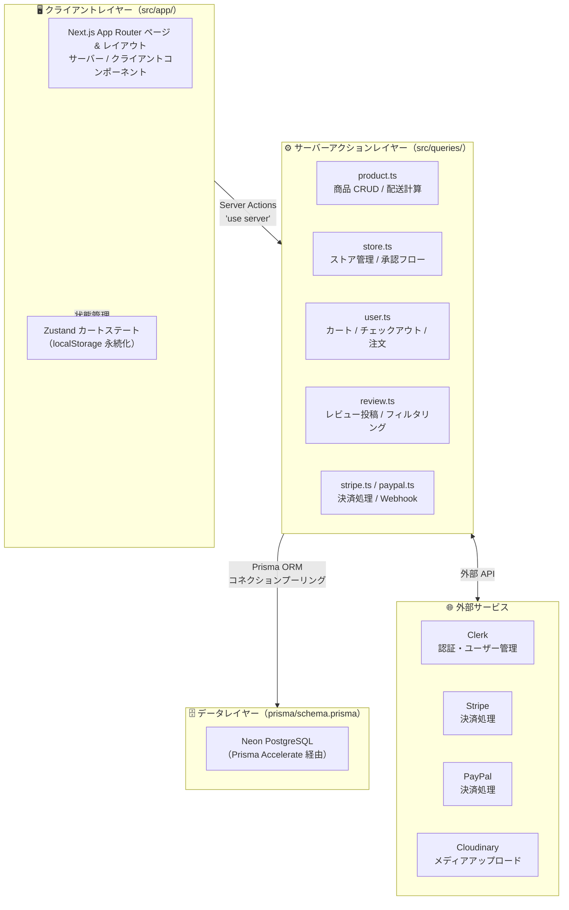
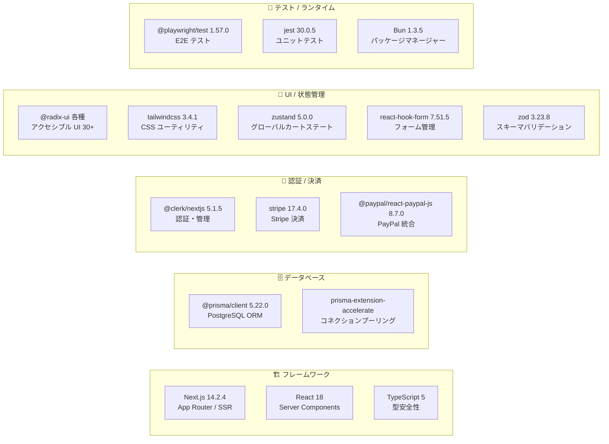
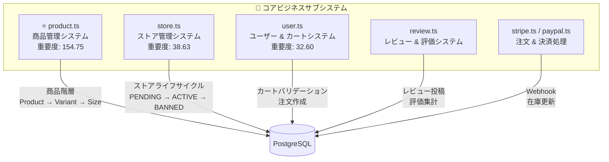
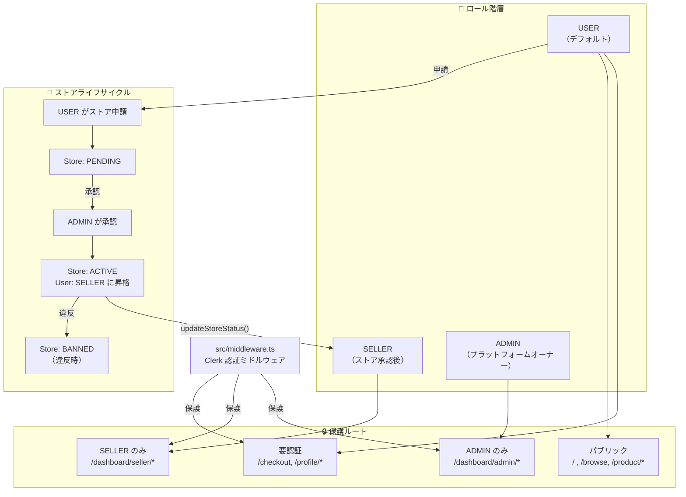
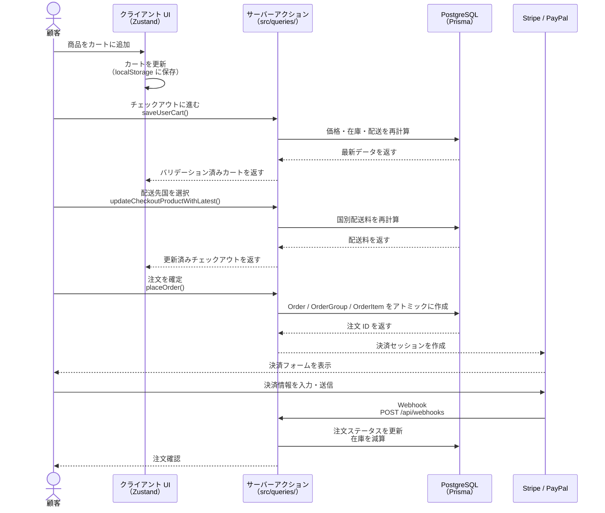
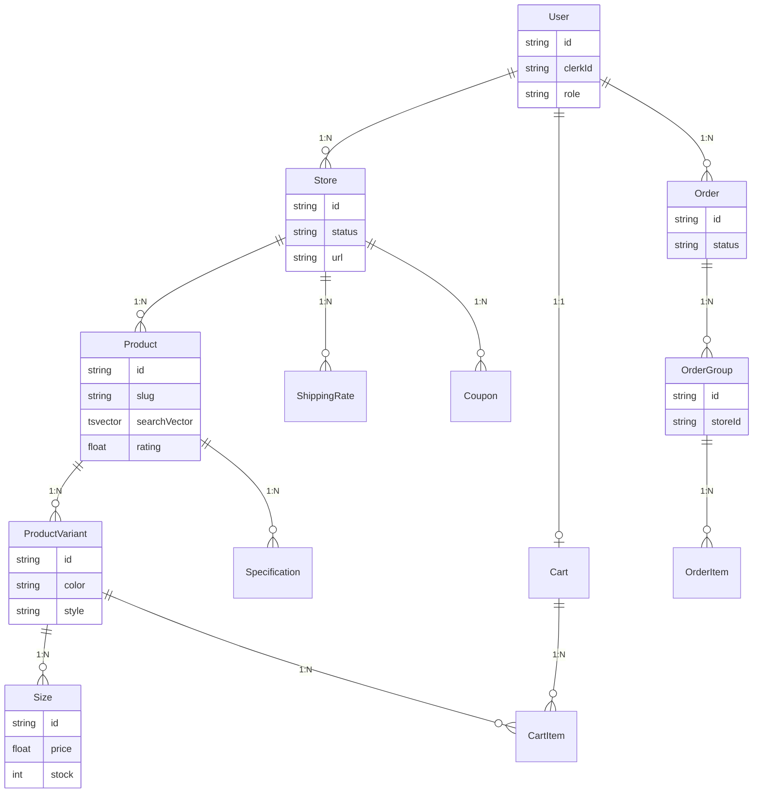
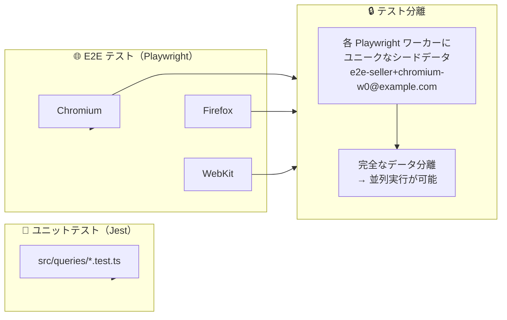
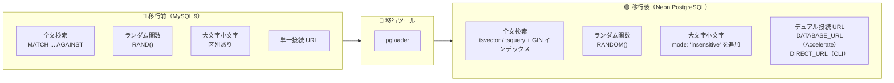

# 概要

[](https://deepwiki.com/myoshi2891/Multi-Vendor-E-Commerce)

**関連ソースファイル**: `CLAUDE.md` / `package.json` / `src/lib/db.ts` / `src/app/layout.tsx` / `src/middleware.ts` / `specs/multi-vendor-ecommerce/04-interfaces.md`

このドキュメントは、マルチベンダー EC プラットフォームのアーキテクチャ・技術スタック・コアビジネスシステムの概要を提供します。このプラットフォームは、複数の独立した出品者が統一されたマーケットプレイス内で店舗を運営し、顧客が異なるベンダーから一度の取引で購入できる仕組みを実現しています。

各サブシステムの詳細については以下を参照してください。

- アーキテクチャパターン → [System Architecture]
- ドメインロジック → [Core Business Systems]
- フロントエンドコンポーネント → [User Interfaces]
- ツールとテスト → [Development & Infrastructure]

---

## プラットフォームの目的と機能

Next.js 14 App Router で構築された**マルチベンダー EC マーケットプレイス**で、3 つの異なるユーザーロールをサポートします。

| ロール | できること |
|--------|-----------|
| **USER** | 商品閲覧・カート管理・注文・レビュー投稿・ストアのフォロー |
| **SELLER** | ストア作成・管理、バリアント付き商品の出品、配送料の設定、注文の出荷 |
| **ADMIN** | ストアの承認・カテゴリ管理・プラットフォームコンテンツのモデレーション |

**主な機能**:

- **複雑な商品階層**: 商品は複数のバリアント（カラー・スタイル）を持ち、各バリアントに独立した価格設定の複数サイズが存在
- **マルチベンダー注文処理**: 1 回のチェックアウトがストアごとの注文グループに分割され、独立したフルフィルメントが可能
- **柔軟な配送システム**: 3 種類の計算方法（個数ベース・重量ベース・定額）と国別上書き設定
- **デュアル決済ゲートウェイ**: 国際対応のための Stripe と PayPal の両方に対応
- **リアルタイム在庫管理**: 注文時のバリデーションパイプラインによる在庫の即時更新
- **全文商品検索**: GIN インデックスを用いた PostgreSQL の `tsvector`/`tsquery` による高パフォーマンス検索

---

## システムアーキテクチャ: 3 層設計


```mermaid
graph TD
    subgraph CLIENT["🖥️ クライアントレイヤー（src/app/）"]
        PAGES["Next.js App Router ページ & レイアウト<br>サーバー / クライアントコンポーネント"]
        ZUSTAND["Zustand カートステート<br>（localStorage 永続化）"]
    end

    subgraph SERVER["⚙️ サーバーアクションレイヤー（src/queries/）"]
        PRODUCT["product.ts<br>商品 CRUD / 配送計算"]
        STORE["store.ts<br>ストア管理 / 承認フロー"]
        USER["user.ts<br>カート / チェックアウト / 注文"]
        REVIEW["review.ts<br>レビュー投稿 / フィルタリング"]
        PAYMENTS["stripe.ts / paypal.ts<br>決済処理 / Webhook"]
    end

    subgraph DATA["🗄️ データレイヤー（prisma/schema.prisma）"]
        PG["Neon PostgreSQL<br>（Prisma Accelerate 経由）"]
    end

    subgraph EXTERNAL["🌐 外部サービス"]
        CLERK["Clerk<br>認証・ユーザー管理"]
        STRIPE["Stripe<br>決済処理"]
        PAYPAL["PayPal<br>決済処理"]
        CLOUDINARY["Cloudinary<br>メディアアップロード"]
    end

    CLIENT -->|"Server Actions<br>'use server'"| SERVER
    SERVER -->|"Prisma ORM<br>コネクションプーリング"| DATA
    CLIENT -->|"状態管理"| ZUSTAND
    SERVER <-->|"外部 API"| EXTERNAL
```

**アーキテクチャレイヤー**:

1. **クライアントレイヤー**（`src/app/`）: Next.js App Router のページとレイアウト、サーバー・クライアントコンポーネント
2. **サーバーアクションレイヤー**（`src/queries/`）: `"use server"` ディレクティブを使ったビジネスロジック・直接 DB アクセス
3. **データレイヤー**（`prisma/schema.prisma`）: コネクションプーリング付き Prisma ORM 経由の PostgreSQL
4. **外部サービス**: Clerk（認証）・Stripe/PayPal（決済）・Cloudinary（メディア）・Neon（DB ホスティング）
5. **クライアントステート**: カート操作用 Zustand（localStorage に永続化）

---

## 技術スタック


```mermaid
graph LR
    subgraph FRAMEWORK["🏗️ フレームワーク"]
        NEXT["Next.js 14.2.4<br>App Router / SSR"]
        REACT["React 18<br>Server Components"]
        TS["TypeScript 5<br>型安全性"]
    end

    subgraph DB_STACK["🗄️ データベース"]
        PRISMA["@prisma/client 5.22.0<br>PostgreSQL ORM"]
        ACCEL["prisma-extension-accelerate<br>コネクションプーリング"]
    end

    subgraph AUTH_PAY["🔐 認証 / 決済"]
        CLERK2["@clerk/nextjs 5.1.5<br>認証・管理"]
        STRIPE2["stripe 17.4.0<br>Stripe 決済"]
        PP["@paypal/react-paypal-js 8.7.0<br>PayPal 統合"]
    end

    subgraph UI_STATE["🎨 UI / 状態管理"]
        RADIX["@radix-ui 各種<br>アクセシブル UI 30+"]
        TW["tailwindcss 3.4.1<br>CSS ユーティリティ"]
        ZUS["zustand 5.0.0<br>グローバルカートステート"]
        RHF["react-hook-form 7.51.5<br>フォーム管理"]
        ZOD["zod 3.23.8<br>スキーマバリデーション"]
    end

    subgraph TESTING["🧪 テスト / ランタイム"]
        PW["@playwright/test 1.57.0<br>E2E テスト"]
        JEST["jest 30.0.5<br>ユニットテスト"]
        BUN["Bun 1.3.5<br>パッケージマネージャー"]
    end
```

| カテゴリ | パッケージ | バージョン | 用途 |
|---------|-----------|-----------|------|
| **フレームワーク** | `next` | 14.2.4 | App Router・SSR・ルーティング |
| | `react` | 18 | UI ライブラリ・Server Components |
| | `typescript` | 5 | 型安全性 |
| **データベース** | `@prisma/client` | 5.22.0 | PostgreSQL 用 ORM |
| | `@prisma/extension-accelerate` | 1.2.0 | コネクションプーリング |
| **認証** | `@clerk/nextjs` | 5.1.5 | ユーザー認証・管理 |
| **決済** | `stripe` | 17.4.0 | Stripe 決済処理 |
| | `@paypal/react-paypal-js` | 8.7.0 | PayPal 統合 |
| **メディア** | `next-cloudinary` | 6.6.2 | Cloudinary 画像アップロード |
| **UI コンポーネント** | `@radix-ui/react-*` | 各種 | アクセシブル UI プリミティブ（30+） |
| | `tailwindcss` | 3.4.1 | CSS ユーティリティフレームワーク |
| | `lucide-react` | 0.394.0 | アイコンライブラリ |
| **状態管理** | `zustand` | 5.0.0 | グローバルカートステート |
| | `react-hook-form` | 7.51.5 | フォーム管理 |
| | `zod` | 3.23.8 | スキーマバリデーション |
| **テスト** | `@playwright/test` | 1.57.0 | E2E テスト |
| | `jest` | 30.0.5 | ユニットテスト |
| **ランタイム** | Bun | — | パッケージマネージャー・ランタイム（npm の代替） |

---

## コアビジネスサブシステム

プラットフォームは `src/queries/` にサーバーアクションとして実装された **5 つの主要ドメインサブシステム**で構成されています。


```mermaid
graph TD
    subgraph SYSTEMS["🏢 コアビジネスサブシステム"]
        P["⭐ product.ts<br>商品管理システム<br>重要度: 154.75"]
        S["store.ts<br>ストア管理システム<br>重要度: 38.63"]
        U["user.ts<br>ユーザー & カートシステム<br>重要度: 32.60"]
        R["review.ts<br>レビュー & 評価システム"]
        PAY["stripe.ts / paypal.ts<br>注文 & 決済処理"]
    end

    P -->|"商品階層<br>Product → Variant → Size"| DB2[("PostgreSQL")]
    S -->|"ストアライフサイクル<br>PENDING → ACTIVE → BANNED"| DB2
    U -->|"カートバリデーション<br>注文作成"| DB2
    R -->|"レビュー投稿<br>評価集計"| DB2
    PAY -->|"Webhook<br>在庫更新"| DB2
```

### 1. 商品管理システム（`product.ts`）

**重要度: 154.75**（最も重要なサブシステム）

- **商品階層**: `Product` → `ProductVariant`（カラー・スタイル）→ `Size`（価格・在庫）
- **主要関数**: `getProducts()`, `getProductPageData()`, `upsertProduct()`, `deleteProduct()`
- **配送計算機**: `getShippingDetails()`（3 メソッド: ITEM / WEIGHT / FIXED）
- **検索統合**: PostgreSQL `tsvector` インデックスによる全文検索

### 2. ストア管理システム（`store.ts`）

**重要度: 38.63**（マルチベンダーのコア）

- **ストアライフサイクル**: PENDING → ACTIVE → BANNED（管理者承認が必要）
- **配送設定**: デフォルトレート + 国別の `ShippingRate` 上書き設定
- **主要関数**: `upsertStore()`, `updateStoreStatus()`, `getStoreData()`
- **ロール昇格**: ストア承認時に USER → SELLER に昇格

### 3. ユーザー & カートシステム（`user.ts`）

**重要度: 32.60**（チェックアウトのオーケストレーション）

- **カートバリデーションパイプライン**: `saveUserCart()` がサーバーサイドで価格・在庫・配送を検証
- **注文作成**: `placeOrder()` が `Order` → `OrderGroup`（ストアごと）→ `OrderItem` を生成
- **住所管理**: ユーザーごとに複数の配送先住所
- **主要関数**: `updateUserInfo()`, `updateCheckoutProductWithLatest()`, `getUserCart()`

### 4. レビュー & 評価システム（`review.ts`）

- **レビュー投稿**: Cloudinary 画像アップロード付きの `upsertReview()`
- **評価の集計**: レビューごとに `Product.rating` と `numReviews` を更新
- **フィルタリング**: 星評価・画像有無・ソート順での `getProductFilteredReviews()`
- **詳細なコンテキスト**: バリアント・サイズ・購入数量を記録

### 5. 注文 & 決済処理（`stripe.ts`, `paypal.ts`）

- **決済ゲートウェイ**: Stripe と PayPal のデュアル統合
- **注文の分解**: 顧客の 1 つの注文がストールレベルの `OrderGroup` に分割
- **在庫更新**: 決済成功時に在庫をアトミックに減算
- **Webhook 処理**: `POST /api/webhooks` で決済確認を処理

---

## ユーザーロールとアクセス制御


```mermaid
flowchart TD
    subgraph ROLES["👤 ロール階層"]
        USER_R["USER<br>（デフォルト）"]
        SELLER_R["SELLER<br>（ストア承認後）"]
        ADMIN_R["ADMIN<br>（プラットフォームオーナー）"]
    end

    subgraph LIFECYCLE["🏪 ストアライフサイクル"]
        APPLY["USER がストア申請"]
        PENDING["Store: PENDING"]
        APPROVE["ADMIN が承認"]
        ACTIVE["Store: ACTIVE<br>User: SELLER に昇格"]
        BANNED["Store: BANNED<br>（違反時）"]
    end

    subgraph ROUTES["🔒 保護ルート"]
        PUBLIC["パブリック<br>/ , /browse, /product/*"]
        PROTECTED["要認証<br>/checkout, /profile/*"]
        SELLER_R2["SELLER のみ<br>/dashboard/seller/*"]
        ADMIN_R2["ADMIN のみ<br>/dashboard/admin/*"]
    end

    USER_R -->|"申請"| APPLY
    APPLY --> PENDING
    PENDING -->|"承認"| APPROVE
    APPROVE --> ACTIVE
    ACTIVE -->|"違反"| BANNED
    ACTIVE -->|"updateStoreStatus()"| SELLER_R

    USER_R --> PUBLIC
    USER_R --> PROTECTED
    SELLER_R --> SELLER_R2
    ADMIN_R --> ADMIN_R2

    MW["src/middleware.ts<br>Clerk 認証ミドルウェア"]
    MW -->|"保護"| PROTECTED
    MW -->|"保護"| SELLER_R2
    MW -->|"保護"| ADMIN_R2
```

| ロール | アクセスレベル | 主なルート | サーバーアクション |
|--------|-------------|-----------|----------------|
| **USER** | デフォルト | `/`, `/browse`, `/product/*`, `/checkout`, `/profile/*` | 注文・レビュー投稿・カート管理 |
| **SELLER** | ストア承認後 | `/dashboard/seller/*`, `/dashboard/seller/stores/[storeUrl]/*` | 商品作成・在庫管理・配送設定・注文対応 |
| **ADMIN** | プラットフォームオーナー | `/dashboard/admin/*` | ストア承認・カテゴリ管理・コンテンツモデレーション |

**アクセス制御の実装**:

- **ミドルウェア**: `src/middleware.ts` が `/dashboard/*`・`/checkout`・`/profile/*` を保護
- **サーバーアクション**: Clerk の `currentUser()` で ID とロールを検証
- **ロール昇格**: `src/queries/store.ts` の `updateStoreStatus()` が USER → SELLER に昇格

---

## データフロー: 商品閲覧から注文完了まで


```mermaid
sequenceDiagram
    actor C as 顧客
    participant UI as クライアント UI<br/>（Zustand）
    participant SA as サーバーアクション<br/>（src/queries/）
    participant DB as PostgreSQL<br/>（Prisma）
    participant PAY as Stripe / PayPal

    C->>UI: 商品をカートに追加
    UI->>UI: カートを更新<br/>（localStorage に保存）

    C->>SA: チェックアウトに進む<br/>saveUserCart()
    SA->>DB: 価格・在庫・配送を再計算
    DB-->>SA: 最新データを返す
    SA-->>UI: バリデーション済みカートを返す

    C->>SA: 配送先国を選択<br/>updateCheckoutProductWithLatest()
    SA->>DB: 国別配送料を再計算
    DB-->>SA: 配送料を返す
    SA-->>UI: 更新済みチェックアウトを返す

    C->>SA: 注文を確定<br/>placeOrder()
    SA->>DB: Order / OrderGroup / OrderItem をアトミックに作成
    DB-->>SA: 注文 ID を返す
    SA-->>PAY: 決済セッションを作成

    PAY-->>C: 決済フォームを表示
    C->>PAY: 決済情報を入力・送信
    PAY->>SA: Webhook<br/>POST /api/webhooks
    SA->>DB: 注文ステータスを更新<br/>在庫を減算
    SA-->>C: 注文確認
```

**主なバリデーションポイント**:

1. **クライアントサイドカート**（Zustand）: 高速な UI 更新・localStorage 永続化
2. **サーバーサイドバリデーション**（`saveUserCart`）: データベースから価格・在庫・配送を再計算
3. **チェックアウト更新**（`updateCheckoutProductWithLatest`）: 選択した国の配送料を再計算
4. **注文作成**（`placeOrder`）: 在庫更新を含むアトミックトランザクション
5. **決済 Webhook**: 確認済み決済で注文ステータスを更新

---

## プロジェクトのディレクトリ構成

```
Multi-Vendor-E-Commerce/
├── src/
│   ├── app/                          # Next.js App Router ページ
│   │   ├── (store)/                  # カスタマー向けページ（公開）
│   │   │   ├── page.tsx              # ホームページ
│   │   │   ├── browse/               # 商品閲覧
│   │   │   ├── product/[slug]/       # 商品詳細ページ
│   │   │   ├── cart/                 # ショッピングカート
│   │   │   ├── checkout/             # チェックアウトフロー（要認証）
│   │   │   └── profile/              # ユーザープロフィール（要認証）
│   │   ├── (auth)/                   # Clerk 認証ページ
│   │   │   ├── sign-in/
│   │   │   └── sign-up/
│   │   ├── dashboard/                # 保護されたダッシュボード
│   │   │   ├── admin/                # 管理者ページ（ADMIN ロールのみ）
│   │   │   └── seller/               # 出品者ページ（SELLER ロールのみ）
│   │   ├── api/                      # API ルート
│   │   │   ├── webhooks/             # Clerk / Stripe Webhook
│   │   │   └── search-products/      # 検索エンドポイント
│   │   └── layout.tsx                # プロバイダー付きルートレイアウト
│   ├── queries/                      # サーバーアクション（ビジネスロジック）
│   │   ├── product.ts                # ⭐ 商品 CRUD・配送計算
│   │   ├── store.ts                  # ストア管理・承認フロー
│   │   ├── user.ts                   # カート・チェックアウト・注文作成
│   │   ├── review.ts                 # レビュー投稿・フィルタリング
│   │   ├── category.ts               # カテゴリ管理
│   │   └── coupon.ts                 # クーポンバリデーション
│   ├── components/                   # React コンポーネント
│   │   ├── ui/                       # shadcn/ui プリミティブ
│   │   ├── store/                    # カスタマー向けコンポーネント
│   │   ├── dashboard/                # ダッシュボード専用コンポーネント
│   │   └── shared/                   # アプリ全体で共有
│   ├── cart-store/                   # Zustand カートステート
│   │   └── cart-store.ts
│   ├── lib/                          # ユーティリティと設定
│   │   ├── db.ts                     # Prisma クライアントシングルトン
│   │   ├── schemas.ts                # Zod バリデーションスキーマ
│   │   ├── types.ts                  # TypeScript 型定義
│   │   └── utils.ts                  # ユーティリティ関数
│   └── middleware.ts                 # Clerk 認証ミドルウェア
├── prisma/
│   ├── schema.prisma                 # データベーススキーマ（PostgreSQL）
│   └── migrations/                   # マイグレーション履歴
├── tests/
│   └── e2e/                          # Playwright E2E テスト
│       ├── seed/seed-e2e.ts          # テストデータシード
│       └── cart-smoke.spec.ts        # テストスペックの例
├── public/                           # 静的アセット
├── package.json                      # 依存関係とスクリプト
├── next.config.mjs                   # Next.js 設定
├── tailwind.config.ts                # Tailwind CSS 設定
├── tsconfig.json                     # TypeScript 設定
└── playwright.config.ts              # Playwright E2E テスト設定
```

**主な設計上の決定事項**:

- **`src/actions/` ディレクトリなし**: 全サーバーアクションは `"use server"` ディレクティブを付けて `src/queries/` に配置
- **クエリのコロケーション**: ドメインごとに同一ファイルに CRUD と データ取得を配置
- **パスエイリアス**: `@/*` → `src/*`、`@/store` → `src/components/store`
- **保護ルート**: ルートレベルのミドルウェアが `/dashboard/*`・`/checkout`・`/profile/*` へのアクセスを制御

---

## データベースアーキテクチャ: PostgreSQL with Prisma


```mermaid
erDiagram
    User ||--o{ Store : "1:N"
    User ||--o| Cart : "1:1"
    User ||--o{ Order : "1:N"

    Store ||--o{ Product : "1:N"
    Store ||--o{ ShippingRate : "1:N"
    Store ||--o{ Coupon : "1:N"

    Product ||--o{ ProductVariant : "1:N"
    Product ||--o{ Specification : "1:N"

    ProductVariant ||--o{ Size : "1:N"
    ProductVariant ||--o{ CartItem : "1:N"

    Cart ||--o{ CartItem : "1:N"

    Order ||--o{ OrderGroup : "1:N"
    OrderGroup ||--o{ OrderItem : "1:N"

    User {
        string id
        string clerkId
        string role
    }
    Store {
        string id
        string status
        string url
    }
    Product {
        string id
        string slug
        tsvector searchVector
        float rating
    }
    ProductVariant {
        string id
        string color
        string style
    }
    Size {
        string id
        float price
        int stock
    }
    Order {
        string id
        string status
    }
    OrderGroup {
        string id
        string storeId
    }
```

**重要な設計ポイント**:

- **Size レベルでの価格管理**: `ProductVariant` 内の各 `Size` が独立した価格と在庫を持つ
- **マルチストア注文**: `Order` がストアごとの `OrderGroup` に分解され、独立したフルフィルメントが可能
- **全文検索**: `Product` の `tsvector` カラムと GIN インデックスによる高パフォーマンス検索
- **デュアル接続 URL**: アプリ用の `DATABASE_URL`（Accelerate 経由）と CLI 操作用の `DIRECT_URL`

```typescript
// src/lib/db.ts
const createPrismaClient = () =>
  new PrismaClient().$extends(withAccelerate());
```

---

## 開発環境とワークフロー

### 前提条件

- **Bun**（ランタイムおよびパッケージマネージャー、npm の代替）
- **PostgreSQL** データベース（Neon ホステッドまたはローカル）
- **Clerk** アカウント（認証）
- **Stripe / PayPal** アカウント（決済処理）
- **Cloudinary** アカウント（メディアアップロード）

### 必要な環境変数

```env
DATABASE_URL=                    # Prisma Accelerate 接続 URL
DIRECT_URL=                      # マイグレーション用の直接 PostgreSQL URL
NEXT_PUBLIC_CLERK_PUBLISHABLE_KEY=
CLERK_SECRET_KEY=
WEBHOOK_SECRET=                  # Clerk Webhook 署名
STRIPE_SECRET_KEY=
NEXT_PUBLIC_STRIPE_PUBLIC_KEY=
PAYPAL_SECRET=
NEXT_PUBLIC_PAYPAL_CLIENT_ID=
```

### 主な開発コマンド

| コマンド | 用途 |
|---------|------|
| `bun run dev` | http://localhost:3000 で Next.js 開発サーバーを起動 |
| `bun run build` | プロダクションビルド |
| `bun run lint` | ESLint チェック |
| `bunx prettier --write <file>` | コードフォーマット |
| `bunx prisma generate` | Prisma クライアントを再生成 |
| `bunx prisma migrate dev` | マイグレーションを適用（`db push` ではなくこちらを使用） |
| `bunx prisma studio` | データベースブラウザを開く |
| `bun run test` | Jest ユニットテストを実行 |
| `bun run test:watch` | Jest ウォッチモード |
| `bunx playwright test` | E2E テストを実行 |
| `bun run seed:e2e` | テスト用データベースをシード |

### テスト戦略


```mermaid
flowchart LR
    subgraph UNIT["🧪 ユニットテスト（Jest）"]
        J1["src/queries/*.test.ts"]
    end

    subgraph E2E["🌐 E2E テスト（Playwright）"]
        PW1["Chromium"]
        PW2["Firefox"]
        PW3["WebKit"]
    end

    subgraph ISOLATION["🔒 テスト分離"]
        SEED["各 Playwright ワーカーに<br>ユニークなシードデータ<br>e2e-seller+chromium-w0@example.com"]
        PARALLEL["完全なデータ分離<br>→ 並列実行が可能"]
    end

    UNIT --> J1
    E2E --> PW1
    E2E --> PW2
    E2E --> PW3
    PW1 --> ISOLATION
    PW2 --> ISOLATION
    PW3 --> ISOLATION
    SEED --> PARALLEL
```

---

## マイグレーション履歴: MySQL から PostgreSQL へ


```mermaid
flowchart LR
    subgraph BEFORE["🔴 移行前（MySQL 9）"]
        M1["全文検索<br>MATCH ... AGAINST"]
        M2["ランダム関数<br>RAND()"]
        M3["大文字小文字<br>区別あり"]
        M4["単一接続 URL"]
    end

    subgraph TOOL["🔧 移行ツール"]
        PGL["pgloader"]
    end

    subgraph AFTER["🟢 移行後（Neon PostgreSQL）"]
        A1["全文検索<br>tsvector / tsquery + GIN インデックス"]
        A2["ランダム関数<br>RANDOM()"]
        A3["大文字小文字<br>mode: 'insensitive' を追加"]
        A4["デュアル接続 URL<br>DATABASE_URL（Accelerate）<br>DIRECT_URL（CLI）"]
    end

    BEFORE --> TOOL --> AFTER
```

プラットフォームは最近 `pgloader` を使用して **MySQL 9** から **Neon PostgreSQL** に移行しました。主な変更点:

- **全文検索**: `MATCH ... AGAINST` → GIN インデックス付きの `tsvector`/`tsquery`
- **ランダム関数**: `RAND()` → `RANDOM()`
- **大文字小文字の扱い**: `contains` フィルターに `mode: "insensitive"` を追加
- **接続アーキテクチャ**: Prisma Accelerate を使用したデュアル URL 構成

---

## 関連ドキュメント

このプラットフォームの特定の側面については、以下の詳細ドキュメントを参照してください。

- **アーキテクチャパターン** → [System Architecture]
- **商品システムの詳細** → [Product Management System]
- **マルチベンダー機能** → [Store Management System]
- **チェックアウトと注文** → [User Management & Cart System]・[Order & Payment Processing]
- **データベーススキーマ** → [Database Schema & Prisma]
- **配送計算** → [Shipping System]
- **認証フロー** → [Authentication & Authorization]
- **テスト戦略** → [Testing Infrastructure]
- **外部連携** → [External Service Integrations]

---

**ドキュメントバージョン**: Next.js 14.2.4・Prisma 5.22.0・PostgreSQL 移行完了時点のプラットフォームアーキテクチャを記載した初版
