# マルチベンダーEコマースシステム設計書

## 概要

### 関連ソースファイル
* `src/app/(store)/page.tsx`
* `src/lib/types.ts`
* `src/queries/product.ts`
* `prisma/schema.prisma`
* `package.json`
* `src/lib/schemas.ts`
* `src/components/dashboard/forms/product-details.tsx`

### 目的と範囲

この文書は、マルチベンダーEコマースシステムの包括的な概要を提供します。このシステムは、統一されたマーケットプレイスプラットフォーム内で複数の販売者が個別の店舗を運営できるフルスタックWebアプリケーションです。システムは3つの異なるユーザー役割をサポートします：
- **顧客**：商品を閲覧し購入する
- **販売者**：店舗と在庫を管理する
- **管理者**：プラットフォーム運営を監督する

システムは、バリエーションを持つ複雑な商品管理、複数ベンダー間での高度な注文処理、統合決済システム、および包括的な配送計算を処理します。特定のサブシステムの詳細については、**商品管理システム**、**ユーザー管理・カートシステム**、**店舗管理システム**、および**注文・決済処理**をご参照ください。

## システム・アーキテクチャ

マルチベンダーEコマースプラットフォームは、サーバーサイドレンダリング機能を備えたNext.js 14をベースとした現代的なフルスタックアーキテクチャに従っています。システムは3つの主要なユーザーインターフェースと、マルチベンダーマーケットプレイスの複雑なワークフローを処理するいくつかのコアビジネスシステムを中心に構築されています。

### 高レベルシステムアーキテクチャ

```mermaid
graph TB
    %% ユーザーインターフェース層
    UI[ユーザーインターフェース層]
    CUI[顧客UI]
    SUI[販売者UI]
    AUI[管理者UI]
    
    %% アプリケーション層
    APP[アプリケーション層]
    STORE[店舗ページ]
    DASH[ダッシュボード]
    AUTH[認証]
    API[API ルート]
    
    %% ビジネスロジック層
    BL[ビジネスロジック層]
    PM[商品管理]
    OM[注文管理]
    UM[ユーザー管理]
    SM[店舗管理]
    
    %% データアクセス層
    DA[データアクセス層]
    PRISMA[Prisma ORM]
    QUERIES[クエリ関数]
    
    %% データベース層
    DATA[データ層]
    DB[(MySQL データベース)]
    
    %% 外部サービス
    EXT[外部サービス]
    STRIPE[Stripe 決済]
    CLERK[Clerk 認証]
    UPLOAD[UploadThing メディア]
    
    UI --> CUI
    UI --> SUI
    UI --> AUI
    
    CUI --> STORE
    SUI --> DASH
    AUI --> DASH
    
    STORE --> API
    DASH --> API
    AUTH --> API
    
    API --> PM
    API --> OM
    API --> UM
    API --> SM
    
    PM --> QUERIES
    OM --> QUERIES
    UM --> QUERIES
    SM --> QUERIES
    
    QUERIES --> PRISMA
    PRISMA --> DB
    
    API --> STRIPE
    API --> CLERK
    API --> UPLOAD
    
    style UI fill:#e1f5fe
    style APP fill:#f3e5f5
    style BL fill:#e8f5e8
    style DA fill:#fff3e0
    style DATA fill:#ffebee
    style EXT fill:#f1f8e9
```

### コアエンティティ関係

システムのデータモデルは、高度な在庫管理と価格管理を備えたマルチベンダー運営をサポートする複雑な商品-バリアント・アーキテクチャを中心としています。

### ユーザー役割とシステムワークフロー

プラットフォームは3つの異なるユーザー役割をサポートし、それぞれがマルチベンダーマーケットプレイスエコシステムを可能にする専門的なインターフェースと機能を持っています。

## 技術スタックとアーキテクチャ

システムは、TypeScript を使用した Next.js 14 を中心とした現代的な技術スタックを活用し、単一のアプリケーションフレームワーク内でサーバーサイドレンダリングと API 機能の両方を提供します。

### 技術スタック構成図

## コア商品アーキテクチャ

商品システムは、複数の商品構成、価格帯、および異なる販売者間での在庫管理をサポートする高度なバリアントベースアーキテクチャを実装した、アプリケーションの最も複雑な部分を表しています。

### 商品-バリアントデータフロー

### 商品バリアント管理フロー

## 統合ポイントと外部サービス

システムは、認証、決済処理、およびメディア管理機能を提供するためにいくつかの外部サービスと統合し、包括的なEコマースソリューションを作成します。

### サービス統合アーキテクチャ

### システム間通信フロー

## 主要機能システム

### 1. 商品管理システム

商品管理システムは、複数のバリアント、動的価格設定、および包括的な在庫追跡を持つ複雑な商品カタログを処理する高度なアーキテクチャを実装しています。

#### 商品階層構造

### 2. 注文処理システム

複数ベンダー間での注文処理を調整し、決済、在庫更新、および配送管理を処理します。

#### 注文処理フロー

### 3. 店舗管理システム

販売者が独立した店舗運営を行えるよう、包括的な店舗管理機能を提供します。

#### 店舗運営ダッシュボード

## データベーススキーマ設計

### 主要テーブル関係

## API設計とエンドポイント

### RESTful API エンドポイント

## セキュリティとパフォーマンス

### セキュリティアーキテクチャ

## 結論

マルチベンダーEコマースシステムは、マルチベンダー運営の複雑さと、すべてのステークホルダーにとってのユーザーフレンドリーなインターフェースをバランスよく取る高度なマーケットプレイスプラットフォームを表しています。このアーキテクチャは、統一されたプラットフォーム体験内で複数の独立した店舗にわたって、スケーラブルな商品管理、安全な取引処理、および包括的な注文履行をサポートします。

### 主要な技術的成果

- **モジュラー設計**: 各システムコンポーネントが独立して拡張可能
- **型安全性**: TypeScript と Zod による包括的な型検証
- **パフォーマンス**: Next.js 14 による最適化されたサーバーサイドレンダリング
- **スケーラビリティ**: Prisma ORM による効率的なデータベース操作
- **セキュリティ**: Clerk による企業級認証とセキュリティ

### 将来の拡張可能性

このアーキテクチャは以下の機能拡張に対応可能です：
- マルチテナント機能の強化
- 高度な分析とレポート機能
- 第三者配送業者との統合
- モバイルアプリケーションサポート
- 国際化とマルチ通貨対応
