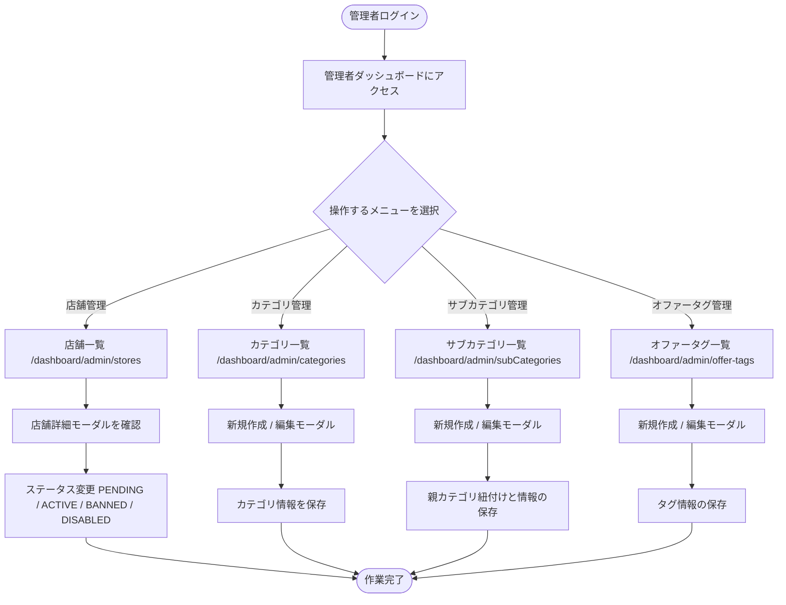
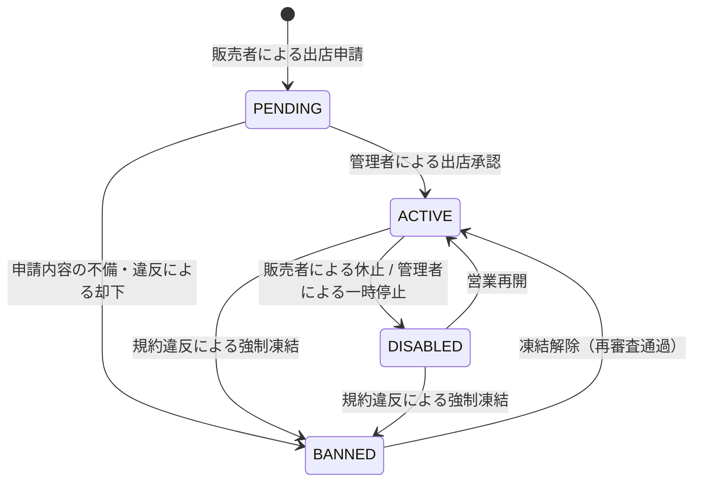

# 管理者権限アプリ使用マニュアル

本マニュアルは、マルチベンダーEコマースマーケットプレイスにおける管理者（ADMIN）権限を持つユーザーが、システム管理・運用を行うための操作手順書です。

---

## 1. はじめに

システムにおける管理者（ADMIN）は、プラットフォーム全体の健全性とデータ構造の維持を担当する重要なロールです。主に以下の責任を持ちます。

* **店舗のライフサイクル管理**: 新規店舗の出店申請（PENDING）のレビュー、承認（ACTIVE）、違反店舗の停止・禁止（BANNED / DISABLED）処理。
* **商品カテゴリ構造（分類）の管理**: 商品分類の基盤となるカテゴリ・サブカテゴリの作成・管理。
* **プロモーションラベルの管理**: 特定のキャンペーンやセールを管理するためのオファータグ管理。

### ユーザーロール比較

| ロール名 | 役割 | 主な操作範囲 |
| :--- | :--- | :--- |
| **ADMIN（管理者）** | プラットフォーム運営者 | 店舗ステータス管理、カテゴリ、サブカテゴリ、オファータグ管理 |
| **SELLER（販売者）** | 出店者・ショップオーナー | 自店舗管理、商品登録・在庫管理、配送設定、注文履行 |
| **USER（顧客）** | 一般購入者 | 商品閲覧・検索、カート追加、決済、注文履歴確認、レビュー投稿 |

---

## 2. ログインと管理画面へのアクセス方法

管理者画面（管理者ダッシュボード）にアクセスするには、管理者権限が設定されたアカウントでログインする必要があります。

### アクセス手順

1. ブラウザでフロントエンドのトップページを開きます。
2. ログイン画面（`/sign-in`）へ遷移し、管理者用アカウントの認証情報（メールアドレスおよびパスワード）を入力してサインインします。
3. サインイン完了後、管理者ダッシュボードのルートURL（`/dashboard/admin`）へ直接アクセスするか、ナビゲーションからダッシュボードを選択します。

> [!WARNING]
> 管理者権限（`privateMetadata.role === "ADMIN"`）を持たない一般ユーザーや販売者がダッシュボードURL（`/dashboard/admin`）にアクセスしようとした場合、自動的にトップページ（`/`）へリダイレクトされ、アクセスは拒否されます。

### ダッシュボードの基本レイアウト

* **サイドバー（Sidebar）**: 画面左側に固定。管理者専用のナビゲーションメニューが表示され、各管理機能へ1クリックで遷移できます。
* **ヘッダー（Header）**: 画面上部。ログイン中の管理者ユーザー情報やプロファイル設定へのリンクが表示されます。
* **メインコンテンツ領域**: 画面中央〜右側。選択された管理機能の一覧テーブルやフォームが表示されます。

---

## 3. 管理者ワークフローと機能一覧

管理者が行う主要な操作フローおよび管理画面のURL構成は以下の通りです。

### 全体ワークフロー

### 管理者機能とURL一覧

| 機能名 | URLパス | 主な管理対象 |
| :--- | :--- | :--- |
| **ダッシュボード** | `/dashboard/admin` | 管理者概要・インデックスページ |
| **店舗管理** | `/dashboard/admin/stores` | 出店店舗一覧、ステータス変更（承認/禁止等）、詳細確認、店舗削除 |
| **カテゴリ管理** | `/dashboard/admin/categories` | ルートカテゴリの作成、編集、削除、Featured（おすすめ）設定 |
| **サブカテゴリ管理**| `/dashboard/admin/subCategories` | サブカテゴリの作成、親カテゴリとの紐付け、編集、削除 |
| **オファータグ管理**| `/dashboard/admin/offer-tags` | キャンペーンラベル、セール識別用タグの作成、編集、削除 |

---

## 4. 店舗管理 (Store Management)

店舗管理画面では、プラットフォームに出店しているすべての店舗の状況把握と、出店ステータスのコントロールを行います。

### 4.1 店舗一覧画面
店舗管理ページ（`/dashboard/admin/stores`）を開くと、登録されている店舗の一覧がテーブル形式で表示されます。
* **検索フィルター**: 店舗名（Name）を入力して、目的の店舗をリアルタイムで絞り込むことができます。
* **表示項目**: カバー画像/ロゴ、店舗名、説明文、URL、ステータス、Featured（おすすめ）バッジ。

### 4.2 店舗詳細の確認
店舗の「**View**」ボタンをクリックすると、モーダルウィンドウで店舗の詳細情報が表示されます。
* **基本情報**: 店舗ID、店舗名、説明文（アコーディオン形式で展開可能）、連絡先メールアドレス、電話番号、店舗URL。
* **配送設定詳細 (Shipping Details)**: 販売者が設定した配送サービス名、基本配送料、追加配送料、重量あたり配送料、固定配送料、配送所要日数、返品ポリシーなどの詳細パラメータを監査できます。

### 4.3 店舗ステータスの更新
店舗一覧または詳細モーダルの「**STATUS**」タグをクリックすると、ステータスを変更するためのドロップダウンメニューが表示されます。

#### ステータス一覧と運用定義

| ステータス | 意味 | 動作制限 |
| :--- | :--- | :--- |
| `PENDING` | 出店申請中 | 店舗は一般公開されません。管理者のレビュー待ち状態です。 |
| `ACTIVE` | 営業中（承認済み）| 店舗および店舗内の商品が一般公開され、ユーザーが購入可能になります。 |
| `DISABLED`| 一時停止中 | 店舗は一時的に非公開になります。販売者自身または運営側での一次メンテナンス用です。 |
| `BANNED` | 禁止（凍結） | 規約違反等の理由で強制凍結された状態です。一般公開されず、販売者も操作できません。 |

#### ステータス遷移図

### 4.4 店舗の削除（論理削除 / ソフトデリート）
1. 削除したい店舗の右端にある「アクション（`...`）」ボタンをクリックします。
2. 「**Delete store**」を選択します。
3. 「本当に削除しますか？」という警告ダイアログ（`AlertDialog`）が表示されます。
4. 「**Delete**」ボタンを押すと、店舗の **論理削除（ソフトデリート）** が実行されます。`deleteStore` 操作は店舗レコードの `isDeleted` フラグを `true` に設定し、`deletedAt` に削除日時を記録します。レコード自体はデータベースから物理削除されず、通常の一覧・検索・公開ページから除外（非表示）されます。

> [!NOTE]
> これは論理削除のため、店舗に紐づく商品・バリアント・在庫・配送ルール・クーポンなどの関連データは **物理削除されません**（カスケード削除は行われません）。削除されるのは店舗の `isDeleted` フラグのみで、店舗が非表示になることで配下のデータも通常の導線からは参照されなくなります。データは保持されるため、必要に応じてフラグを戻すことで復旧できる設計ですが、復旧用の管理 UI は現状未提供です。誤操作を避けるため、必ず販売者との合意または最終判断のもとで慎重に行ってください。

---

## 5. カテゴリ管理 (Category Management)

カテゴリは、商品を分類するための最上位の階層（ルートカテゴリ）です。

### 5.1 カテゴリ一覧
カテゴリ管理ページ（`/dashboard/admin/categories`）では、作成済みのカテゴリ名、URL、画像、Featured（おすすめ設定）の有無がリスト表示されます。
* **検索フィルター**: カテゴリ名で絞り込み可能です。

### 5.2 カテゴリの新規作成
1. テーブル右上にある「**Create New Category**」ボタンをクリックします。
2. 新規作成用のモーダルフォームが開きます。以下の項目を入力します。
    * **画像（Image）**: ドラッグ＆ドロップまたはクリックでカテゴリの代表画像をアップロードします（Cloudinaryに自動アップロードされます）。
    * **カテゴリ名 (Category name)**: カテゴリの表示名を入力します（例: `Electronics`）。
    * **カテゴリURL (Category url)**: URLのスラッグ部分を入力します（例: `electronics`）。
    * **Featured (おすすめ)**: チェックを入れると、このカテゴリがホームページのおすすめカテゴリセクションに表示されます。
3. 「**Create category**」ボタンをクリックして作成を完了します。

### 5.3 カテゴリの編集と削除
* **編集**: 対象カテゴリのアクションメニュー（`...`）から「**Edit Details**」を選択し、モーダル内で情報を変更し、「**Save category information**」をクリックします。
* **削除**: アクションメニューから「**Delete category**」を選択し、警告ダイアログを確認の上、削除を実行します。

---

## 6. サブカテゴリ管理 (Subcategory Management)

サブカテゴリは、カテゴリ配下に紐づく第2階層の分類です（例: カテゴリ `Electronics` に対して、サブカテゴリ `Smartphones` や `Laptops` を設定）。

### 6.1 サブカテゴリ一覧
サブカテゴリ管理ページ（`/dashboard/admin/subCategories`）にアクセスすると、登録されているサブカテゴリの一覧が表示されます。
* **検索フィルター**: サブカテゴリ名で検索できます。
* **表示項目**: 画像、サブカテゴリ名、URL、所属カテゴリ（親カテゴリ）、Featured設定。

### 6.2 サブカテゴリの新規作成
1. 「**Create SubCategory**」ボタンをクリックします。
2. 以下の項目を入力します。
    * **画像（Image）**: サブカテゴリ画像をアップロードします。
    * **サブカテゴリ名 (SubCategory name)**: 表示名を入力します。
    * **サブカテゴリURL (SubCategory url)**: URLのスラッグを入力します。
    * **親カテゴリ (Category)**: プルダウンメニューから、このサブカテゴリが所属する親カテゴリを選択します。
    * **Featured (おすすめ)**: チェックを入れると、ホームページ上におすすめサブカテゴリとして表示されます。
3. 「**Create SubCategory**」をクリックして保存します。

### 6.3 サブカテゴリの編集と削除
カテゴリ管理と同様に、アクションメニュー（`...`）から「**Edit Details**」による編集、および「**Delete subcategory**」による削除が可能です。

---

## 7. オファータグ管理 (Offer Tag Management)

オファータグは、商品に対して「10% OFF」「送料無料」「期間限定セール」などの付加価値ラベルを付与してマーケティング効果を高めるためのタグです。

### 7.1 オファータグ一覧
オファータグ管理ページ（`/dashboard/admin/offer-tags`）で現在のタグが一覧表示されます。
* **検索フィルター**: タグ名で検索可能です。

### 7.2 オファータグの新規作成・編集
1. 「**Create offer tag**」ボタンをクリックします。
2. 以下の項目を入力します。
    * **オファータグ名 (Offer tag name)**: ラベル名を入力します（例: `Summer Sale`）。
    * **オファータグURL (Offer tag url)**: スラッグを入力します（例: `summer-sale`）。
3. 「**Create offer tag**」または「**Save offer tag information**」をクリックして適用します。

### 7.3 オファータグの削除
アクションメニュー（`...`）から「**Delete offer tag**」を選択し、削除を実行します。

---

## 8. 運用上の注意点と制限事項

システムを安全かつ円滑に運用するために、管理者として以下の技術的・ビジネス的制約を必ず理解しておいてください。

### 8.1 URLのユニーク制約（重複禁止）
データベースの仕様上、以下のURLフィールドには一意性（ユニーク）制約が設定されています。
* **対象**: `Category.url`、`SubCategory.url`、`Store.url`、`OfferTag.url`
* **影響**: 既に登録されているURLと同じ値（大文字小文字の違いも含む）を新しい項目に設定して保存しようとすると、データベースエラーが発生し保存に失敗します。
* **運用策**: URLを設定する際は、必ず他と重複しないユニークなスラッグを設定してください（例: `sale` が重複した場合は `summer-sale-2026` にするなど）。

### 8.2 金額・配送料の設定
システム内では、配送料金や商品の価格などのすべての金額フィールドに `Decimal(12,2)`（小数点以下2桁までの厳密な計算）を採用しています。
* **影響**: 浮動小数点誤差によるズレを防ぐため、裏側では厳密な計算処理が行われます。
* **運用策**: 管理者として店舗の配送設定を監査またはテストする際は、金額フィールドに無効な文字列や極端な値が入っていないか、小数点第二位までの適切な数値が設定されているかを確認してください。

### 8.3 データの連動削除（カスケード削除）
スキーマ定義上、いくつかの関連データには `ON DELETE CASCADE` が設定されています。
* **影響**: 例えば「カテゴリ」を削除すると、そのカテゴリに紐づいていた「商品」が意図せず無効化または削除される、あるいは「店舗」を削除すると「商品」や「注文データ（一部）」が完全に抹消される可能性があります。
* **運用策**: データを削除する前に、そのカテゴリや店舗にアクティブな商品や未完了の注文が存在しないかを必ず確認してください。可能な限り、物理削除ではなくステータスを `DISABLED` や `BANNED` に変更して非公開化することを推奨します。
