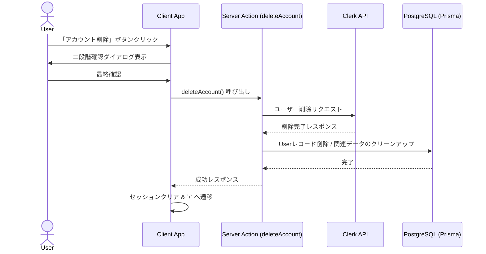

# 顧客プロフィール設定機能 — 詳細設計書 (design.md)

## 1. 画面設計・コンポーネント構成

`/profile/settings` ページは、主にClerkが提供する堅牢なユーザー管理UI `<UserProfile />` を中心に構築します。

### コンポーネントツリー
```
ProfileSettingsPage (app/profile/settings/page.tsx, force-dynamic)
 └── ProfileLayout (レイアウト共通、ナビゲーション)
      └── Card (UI コンテナ)
           └── ClerkUserProfileWrapper
                ├── <UserProfile /> (Clerk標準UI)
                └── DeleteAccountSection (独自実装退会エリア)
```

---

## 2. アカウント削除フロー

アカウント削除（退会）処理は、フロントエンドでのユーザー確認、Clerkからの削除、およびローカルデータベースでの同期から構成されます。

### シーケンス


---

## 3. データベース & Webhook 設計

### DB への影響
Clerk上からユーザーが削除された場合、またはServer Actionから削除される場合、関連する `User` モデルおよびその所有データ（`Store`、`Order`など）の参照整合性を保つ必要があります。

- `User` レコード: `onDelete: Cascade` もしくはアプリケーションレイヤーで注文情報を残しつつユーザー情報を匿名化。
- 本設計では、法的な注文履歴保持のため、`User` レコードは論理削除（`deletedAt` の付与）または個人情報のマスク（匿名化）を行うアプローチを推奨します。

---

## 4. セキュリティ・認可ガード

- 設定ページコンポーネントの先頭で認証状態を確認します。
```typescript
import { auth } from "@clerk/nextjs/server";
import { redirect } from "next/navigation";

export default async function ProfileSettingsPage() {
  const { userId } = await auth();
  if (!userId) {
    redirect("/sign-in");
  }
  // ...
}
```
