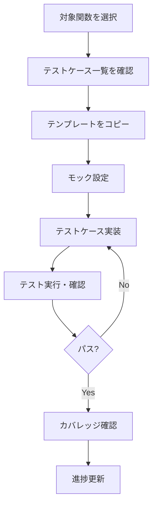

# 優先度マトリクスと進捗トラッキング

このドキュメントでは、テスト作成の優先度と進捗管理について説明します。

---

## 1. 優先度決定基準

### 1.1 評価マトリクス

| 要素                   | 高優先度               | 中優先度             | 低優先度     |
| ---------------------- | ---------------------- | -------------------- | ------------ |
| **ビジネスインパクト** | 金銭処理、セキュリティ | コアビジネスロジック | 補助機能     |
| **使用頻度**           | 全ユーザーが使用       | 一部ユーザーが使用   | 稀に使用     |
| **複雑性**             | 複雑な計算・処理       | 中程度の処理         | 単純なCRUD   |
| **依存関係**           | 多くの機能が依存       | 一部機能が依存       | 独立している |
| **障害発生時の影響**   | サービス停止レベル     | 機能制限レベル       | 軽微な影響   |

### 1.2 優先度スコアリング

各機能を以下の基準で評価し、合計スコアで優先度を決定：

| 基準                 | スコア |
| -------------------- | ------ |
| 金銭に関わる         | +3     |
| セキュリティに関わる | +3     |
| 全ユーザーが使用     | +2     |
| 計算ロジックが複雑   | +2     |
| 外部サービス連携     | +1     |
| データ整合性に影響   | +1     |

**スコア合計**:

- 6以上: 高優先度
- 3-5: 中優先度
- 0-2: 低優先度

---

## 2. Phase別実装計画

### Phase 1: 高優先度（91テストケース）

金銭処理・セキュリティに関わる最重要機能

| ファイル            | 関数数 | テスト数 | ステータス | 担当者 | 完了日 |
| ------------------- | ------ | -------- | ---------- | ------ | ------ |
| `paypal.ts`         | 2      | 11       | [ ] 未着手 | -      | -      |
| `stripe.ts`         | 2      | 11       | [ ] 未着手 | -      | -      |
| `order.ts`          | 3      | 15       | [ ] 未着手 | -      | -      |
| `user.ts` (カート)  | 4      | 25       | [ ] 未着手 | -      | -      |
| `coupon.ts`         | 5      | 20       | [ ] 未着手 | -      | -      |
| `webhooks/route.ts` | 1      | 9        | [ ] 未着手 | -      | -      |

**Phase 1 合計**: 17関数、91テストケース

---

### Phase 2: 中優先度（225テストケース）

コアビジネスロジック

| ファイル          | 関数数 | テスト数 | ステータス | 担当者 | 完了日 |
| ----------------- | ------ | -------- | ---------- | ------ | ------ |
| `store.ts` (残り) | 7      | 35       | [ ] 未着手 | -      | -      |
| `product.ts`      | 12     | 60       | [ ] 未着手 | -      | -      |
| `user.ts` (残り)  | 5      | 20       | [ ] 未着手 | -      | -      |
| `profile.ts`      | 5      | 25       | [ ] 未着手 | -      | -      |
| `review.ts`       | 1      | 10       | [ ] 未着手 | -      | -      |
| `utils.ts`        | 9      | 35       | [ ] 未着手 | -      | -      |
| `schemas.ts`      | 10     | 40       | [ ] 未着手 | -      | -      |

**Phase 2 合計**: 49関数、225テストケース

---

### Phase 3: 低優先度（62テストケース）

補助機能

| ファイル                   | 関数数 | テスト数 | ステータス | 担当者 | 完了日 |
| -------------------------- | ------ | -------- | ---------- | ------ | ------ |
| `category.ts`              | 5      | 15       | [ ] 未着手 | -      | -      |
| `subCategory.ts`           | 5      | 15       | [ ] 未着手 | -      | -      |
| `offer-tag.ts`             | 4      | 12       | [ ] 未着手 | -      | -      |
| `home.ts`                  | 2      | 10       | [ ] 未着手 | -      | -      |
| `size.ts` (追加)           | 1      | 3        | [ ] 未着手 | -      | -      |
| `search-products/route.ts` | 1      | 7        | [ ] 未着手 | -      | -      |

**Phase 3 合計**: 18関数、62テストケース

---

## 3. 進捗サマリー

### 3.1 全体進捗

| Phase    | テストケース数 | 完了数 | 進捗率 | 目標完了日 |
| -------- | -------------- | ------ | ------ | ---------- |
| Phase 1  | 91             | 0      | 0%     | -          |
| Phase 2  | 225            | 0      | 0%     | -          |
| Phase 3  | 62             | 0      | 0%     | -          |
| **合計** | **378**        | **0**  | **0%** | -          |

### 3.2 既存テストの状況

| ファイル        | テスト数 | カバーしている関数                                                             |
| --------------- | -------- | ------------------------------------------------------------------------------ |
| `store.test.ts` | 23       | upsertStore, updateStoreDefaultShippingDetails, getStoreDefaultShippingDetails |
| `size.test.ts`  | 9        | getFilteredSizes                                                               |
| **合計**        | **32**   | -                                                                              |

### 3.3 カバレッジ目標

| フェーズ      | 開始時 | 目標 | 達成日 |
| ------------- | ------ | ---- | ------ |
| 現在          | 0.6%   | -    | -      |
| Phase 1完了後 | -      | 25%  | -      |
| Phase 2完了後 | -      | 60%  | -      |
| Phase 3完了後 | -      | 80%  | -      |

---

## 4. 詳細な進捗チェックリスト

### 4.1 Phase 1: 高優先度

#### paypal.ts

- [ ] createPayPalPayment
  - [ ] 認証済みユーザーで正常にPayPal注文作成
  - [ ] 未認証ユーザーでエラー
  - [ ] 存在しない注文IDでエラー
  - [ ] PayPal APIエラー時のハンドリング
  - [ ] 境界値テスト（金額0、大きい金額）
- [ ] capturePayPalPayment
  - [ ] 決済成功時のステータス更新
  - [ ] キャプチャ失敗時のステータス更新
  - [ ] PaymentDetails upsert処理
  - [ ] purchase_units undefined のハンドリング

#### stripe.ts

- [ ] createStripePaymentIntent
  - [ ] 正常にPaymentIntent作成
  - [ ] 未認証/存在しない注文でエラー
  - [ ] 金額のセント換算検証
  - [ ] 小数点丸め処理
- [ ] createStripePayment
  - [ ] 決済成功/失敗時のステータス更新
  - [ ] PaymentDetails upsert処理

#### order.ts

- [ ] getOrder
  - [ ] 自分の注文取得
  - [ ] 他ユーザー注文へのアクセス拒否
  - [ ] 存在しない注文ID
  - [ ] ソート順の確認
- [ ] updateOrderGroupStatus
  - [ ] SELLER権限検証
  - [ ] ステータス遷移ルール
  - [ ] 他店舗の注文更新拒否
- [ ] updateOrderItemStatus
  - [ ] 所有権検証
  - [ ] ステータス更新

#### user.ts (カート関連)

- [ ] saveUserCart
  - [ ] 在庫検証
  - [ ] 価格計算
  - [ ] 配送料計算（ITEM/WEIGHT/FIXED）
- [ ] placeOrder
  - [ ] 複数店舗の注文グループ作成
  - [ ] クーポン適用
  - [ ] 在庫検証
- [ ] updateCartWithLatest
  - [ ] 最新価格・在庫への更新
- [ ] updateCheckoutProductWithLatest
  - [ ] チェックアウト時の最新化

#### coupon.ts

- [ ] upsertCoupon
  - [ ] 重複コード検出
  - [ ] 権限検証
- [ ] applyCoupon
  - [ ] 有効期限チェック
  - [ ] 開始日チェック
  - [ ] 既存クーポンチェック
  - [ ] 割引計算
- [ ] getStoreCoupons / getCoupon / deleteCoupon
  - [ ] CRUD操作
  - [ ] 権限検証

#### webhooks/route.ts

- [ ] POST handler
  - [ ] user.created イベント処理
  - [ ] user.updated イベント処理
  - [ ] user.deleted イベント処理
  - [ ] 署名検証
  - [ ] ヘッダー検証

---

### 4.2 Phase 2: 中優先度

（詳細は01-test-case-catalog.mdを参照）

- [ ] store.ts (残り) - 35テスト
- [ ] product.ts - 60テスト
- [ ] user.ts (残り) - 20テスト
- [ ] profile.ts - 25テスト
- [ ] review.ts - 10テスト
- [ ] utils.ts - 35テスト
- [ ] schemas.ts - 40テスト

---

### 4.3 Phase 3: 低優先度

（詳細は01-test-case-catalog.mdを参照）

- [ ] category.ts - 15テスト
- [ ] subCategory.ts - 15テスト
- [ ] offer-tag.ts - 12テスト
- [ ] home.ts - 10テスト
- [ ] size.ts (追加) - 3テスト
- [ ] search-products/route.ts - 7テスト

---

## 5. テスト作成のワークフロー

### 5.1 新規テスト作成手順

### 5.2 テスト作成時のチェックポイント

1. **テストケース一覧の確認**

    - [01-test-case-catalog.md](./01-test-case-catalog.md) でテストケースを確認
    - 正常系・異常系・境界値を網羅

2. **ガイドラインの遵守**

    - [02-test-guidelines.md](./02-test-guidelines.md) に従う
    - AAAパターン、命名規則

3. **モックの適切な使用**

    - [03-mock-guide.md](./03-mock-guide.md) を参照
    - TestDataFactory、TestHelpersの活用

4. **パターンの適用**

    - [04-test-patterns.md](./04-test-patterns.md) から適切なパターンを選択

5. **進捗の更新**
    - このファイルのチェックリストを更新
    - カバレッジを確認

---

## 6. 品質基準

### 6.1 テスト品質チェックリスト

- [ ] すべての公開関数にテストがある
- [ ] 正常系テストがある
- [ ] 認証テストがある（該当する場合）
- [ ] 認可テストがある（該当する場合）
- [ ] バリデーションテストがある
- [ ] エラーハンドリングテストがある
- [ ] 境界値テストがある（該当する場合）
- [ ] モックが適切に使用されている
- [ ] テストが独立して実行できる
- [ ] テストが十分に速い（< 5秒/テスト）

### 6.2 コードカバレッジ基準

| メトリクス | 最小値 | 目標値 |
| ---------- | ------ | ------ |
| Statements | 70%    | 80%    |
| Branches   | 65%    | 75%    |
| Functions  | 70%    | 80%    |
| Lines      | 70%    | 80%    |

---

## 7. リスク管理

### 7.1 高リスク領域

以下の領域は特に注意が必要：

| 領域         | リスク           | 対策                           |
| ------------ | ---------------- | ------------------------------ |
| 決済処理     | 金銭的損失       | 徹底的なテスト、E2Eテスト追加  |
| 認証・認可   | セキュリティ侵害 | すべてのエンドポイントをテスト |
| 在庫計算     | 過剰販売         | 境界値テスト、競合テスト       |
| クーポン適用 | 不正利用         | 有効期限、重複適用のテスト     |

### 7.2 テスト不足のリスク

- 決済失敗時の復旧処理
- 同時アクセス時の競合状態
- 外部API障害時のフォールバック
- データ不整合時の処理

---

## 8. 次のアクション

### 8.1 即時対応（1週間以内）

1. [ ] Phase 1の決済関連テスト（paypal.ts, stripe.ts）の作成
2. [ ] CI/CDパイプラインへのテスト統合
3. [ ] カバレッジレポートの自動生成設定

### 8.2 短期対応（1ヶ月以内）

1. [ ] Phase 1の完了
2. [ ] Phase 2の開始
3. [ ] テストデータファクトリーの共通化

### 8.3 中期対応（3ヶ月以内）

1. [ ] Phase 2, 3の完了
2. [ ] E2Eテストの導入検討
3. [ ] パフォーマンステストの導入検討
