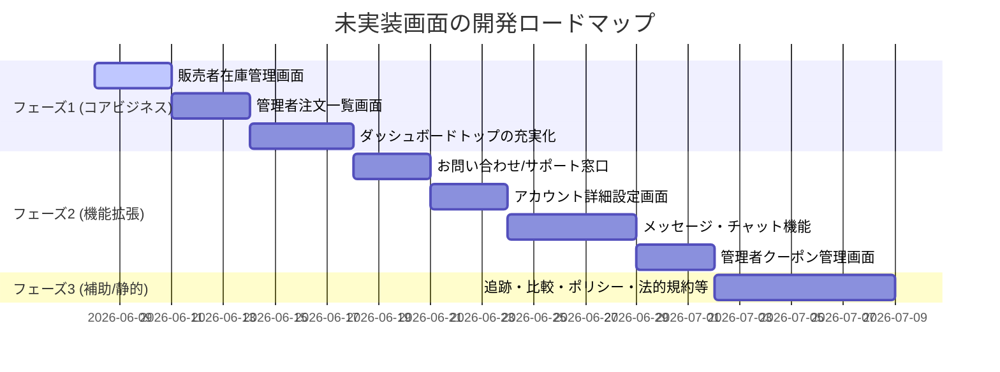

# 未実装画面の洗い出しと開発計画 (Next Tasks Plan)

本プロジェクト（マルチベンダーEコマース）において、画面上にリンクや導線が定義されているものの、実際にはルートディレクトリやページファイル（`page.tsx`）が存在しない、あるいはプレースホルダーのままになっている画面を洗い出しました。これらを今後の開発タスクとして整理し、計画を提示します。

---

## 1. 未実装・プレースホルダー画面の洗い出し

### A. 管理者ダッシュボード (Admin Dashboard)

| リンク/ルート | 現状 | 必要な機能・説明 | 優先度 |
|---|---|---|---|
| `/dashboard/admin` | **プレースホルダー** `
Admin DashboardPage
` | 全体の売上、登録ストア数、未承認ストア数、カテゴリー数などの統計情報を可視化するメインダッシュボード画面。 | 中 |
| `/dashboard/admin/orders` | **ディレクトリ未作成** （サイドバーにリンクあり） | プラットフォーム全体の注文履歴一覧の表示、詳細情報の閲覧、および注文ステータスの変更・管理。 | 高 |
| `/dashboard/admin/coupons` | **ディレクトリ未作成** （サイドバーにリンクあり） | プラットフォーム全体に適用可能な割引クーポンの作成・編集・削除、および適用制限の管理。 | 中 |

### B. 販売者ダッシュボード (Seller Dashboard)

| リンク/ルート | 現状 | 必要な機能・説明 | 優先度 |
|---|---|---|---|
| `/dashboard/seller/stores/[storeUrl]` | **プレースホルダー** `
SellerStorePage
` | 店舗ごとの売上統計、注文数、閲覧数（PV数）などをグラフやカードで表示する、販売者向けのメインダッシュボード画面。 | 中 |
| `/dashboard/seller/stores/[storeUrl]/inventory` | **ディレクトリ未作成** （サイドバーにリンクあり） | 商品バリアントごとの在庫数一覧、在庫数のクイック編集、在庫切れ・過小在庫のアラート通知設定。 | 高 |

### C. 顧客アカウント・メニュー (Profile / Customer Menu)

| リンク/ルート | 現状 | 必要な機能・説明 | 優先度 |
|---|---|---|---|
| `/profile/messages` | **ディレクトリ未作成** （ユーザーメニューにリンクあり） | 購入者と販売者、または運営サポートとの間でメッセージのやり取りを行うチャット・メッセージ画面。 | 中 |
| `/profile/settings` | **ルート未定義** （ユーザーメニューで `/` にリンク） | 会員情報（メールアドレス、氏名）の編集、パスワード変更、多要素認証設定、およびアカウント削除機能。 | 中 |

### D. 静的ページ・補助画面・カスタマーサービス (Storefront Support & Policies)

これらの画面は、フッター（`Footer`）やユーザーメニュー（`UserMenu`）のリスト内に定義されていますが、リンク先が空文字（`""`）であるか、トップページ（`/`）にフォールバック、あるいはディレクトリが存在しない状態です。

| リンク/ルート | 現状 | 必要な機能・説明 | 優先度 |
|---|---|---|---|
| `/about` | ディレクトリ未作成 | 運営会社情報、プラットフォームの紹介などの静的情報ページ。 | 低 |
| `/contact` | ディレクトリ未作成 | ユーザーから運営へのお問い合わせフォーム。 | 高 |
| `/compare` | ディレクトリ未作成 | 複数商品のスペックや価格をグリッド形式で並べて比較する機能画面。 | 低 |
| `/faq` / `/faqs` | ディレクトリ未作成 | よくある質問（FAQ）の一覧・検索ページ。 | 低 |
| `/track-order` | ディレクトリ未作成 | 注文番号とメールアドレスを入力して、配送状況を追跡する画面。 | 中 |
| `/customer-service` | ディレクトリ未作成 | ヘルプセンター、お問い合わせ、返品などのサポート窓口の総合ポータル。 | 低 |
| `/returns-exchange` （または `Return & Refund Policy`） | ディレクトリ未作成 （ユーザーメニューで `/` にリンク） | 返品・交換ポリシーの規約ページ。および返品リクエストフォーム。 | 中 |
| `/product-support` | ディレクトリ未作成 | 購入後の商品に関する技術サポートやトラブルシューティング情報。 | 低 |
| `Legal & Privacy`（`/legal`など） | リンク空文字 | 利用規約、特定商取引法に基づく表記、プライバシーポリシーなどの法的文書ページ。 | 中 |
| `Discounts & Offers`（`/offers`など） | リンク空文字 | プラットフォーム全体で実施中のキャンペーンや割引対象商品の一覧ページ。 | 低 |
| `Order Dispute Resolution` | リンク空文字 | 注文に関するトラブル（商品未着、破損など）の紛争解決手続きと申請フォーム。 | 低 |
| `Report a Problem` | リンク空文字 | バグ報告やガイドライン違反ユーザーの通報フォーム。 | 低 |

---

## 2. ネクストタスク開発計画 (Roadmap)

開発効率とビジネスインパクト（コア取引の成立）を考慮し、タスクを3つのフェーズに分割して進行します。

### 【フェーズ 1】コアビジネス・管理機能の充実 (優先度: 高)
商品の売買、発送、在庫維持に直結する必須画面を構築します。

1. **販売者在庫管理画面 (`/dashboard/seller/stores/[storeUrl]/inventory`)**
   - 商品・バリアント・サイズごとの在庫一覧
   - インラインでの在庫数一括更新機能
2. **管理者注文一覧画面 (`/dashboard/admin/orders`)**
   - プラットフォーム全体の注文検索・ソート
   - 注文詳細の確認、決済ステータス/配送ステータスの確認・更新
3. **ダッシュボードトップの最適化 (`/dashboard/admin`, `/dashboard/seller/stores/[storeUrl]`)**
   - プレースホルダーの廃止
   - Prismaを用いた集計クエリの統合、売上グラフ（Rechartsなど）、最近の注文・新規登録ストアの通知などのウィジェット実装

### 【フェーズ 2】ユーザーコミュニケーション & 設定 (優先度: 中)
顧客のサポート体制とアカウント管理、店舗とのやり取りを円滑にする機能を構築します。

1. **お問い合わせフォーム (`/contact`)**
   - 顧客・ゲストからの問い合わせ送信、管理メール通知またはDB保存
2. **アカウント詳細設定画面 (`/profile/settings`)**
   - 会員情報の更新、Clerkのプロフィール連携
3. **顧客メッセージ機能 (`/profile/messages`)**
   - 購入者-販売者間のチャットUI（必要に応じてWebSocketまたは定期ポーリングの実装）
4. **管理者クーポン管理画面 (`/dashboard/admin/coupons`)**
   - プラットフォーム全体のクーポンの発行・有効無効切り替え

### 【フェーズ 3】静的・ポリシー・付加価値機能 (優先度: 低)
法令遵守のためのドキュメント整備や、購入の意思決定を助ける補助機能を整備します。

1. **ポリシー・法的ドキュメント (`/returns-exchange`, `/legal` など)**
   - 返品交換ポリシー、プライバシーポリシー、利用規約の整備
2. **注文追跡画面 (`/track-order`)**
   - 配送業者のトラッキングAPI連携または簡易ステータス表示
3. **商品比較・サポートページ (`/compare`, `/faq` など)**

---

## 3. 実装上の技術的制約・注意点

- **認証とロール制御 (RBAC)**:
  - 管理者ダッシュボード（`admin` 配下）は、Clerkの `privateMetadata.role === "ADMIN"` のみがアクセスできるように、Next.jsの Middleware (`src/middleware.ts`) またはレイアウトレベルで厳密に制御する必要があります。
  - 販売者ダッシュボード（`seller` 配下）は `SELLER` または `ADMIN` に制限し、さらに**「自身の所有する店舗データ」のみを操作できるよう、Prismaクエリでの所有権の検証（User IDの照合）を徹底**してください。
- **UIデザインの一貫性**:
  - shadcn/ui と Tailwind CSS を使用し、既存のダッシュボードテーマ（slateベース、ダーク/ライトモード対応）に沿って作成します。
  - 金額を扱う処理はすべて `Prisma.Decimal` および `Decimal(12, 2)` の規約を厳守してください。
